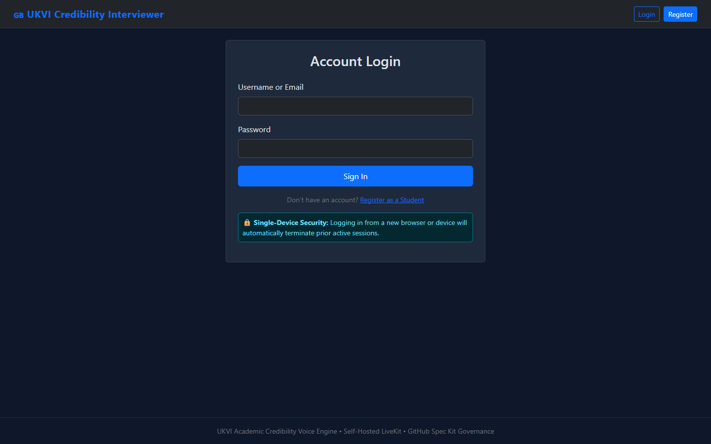
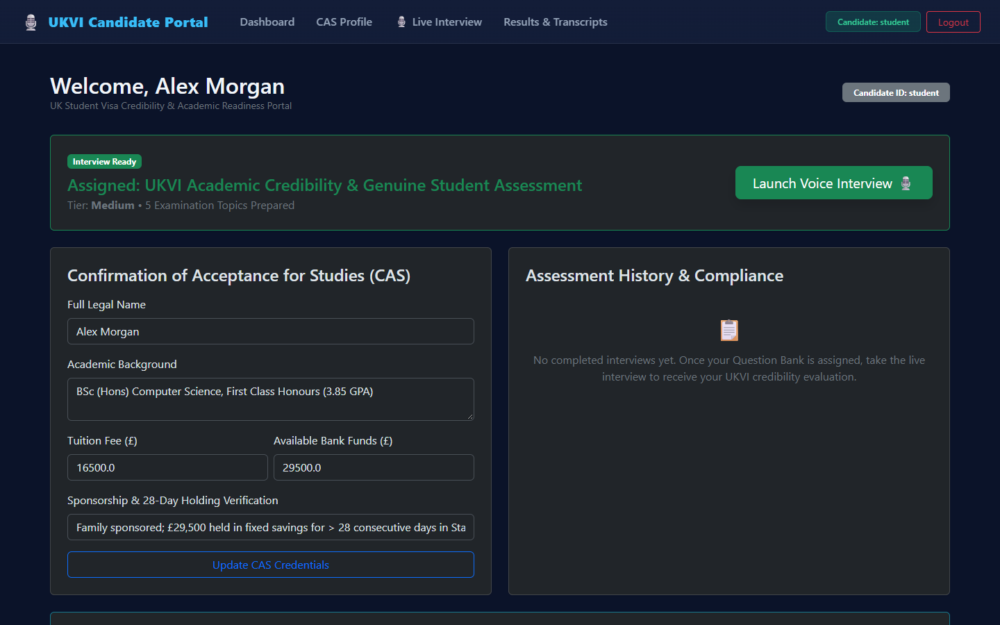
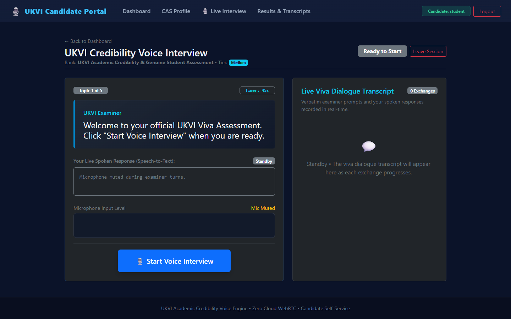
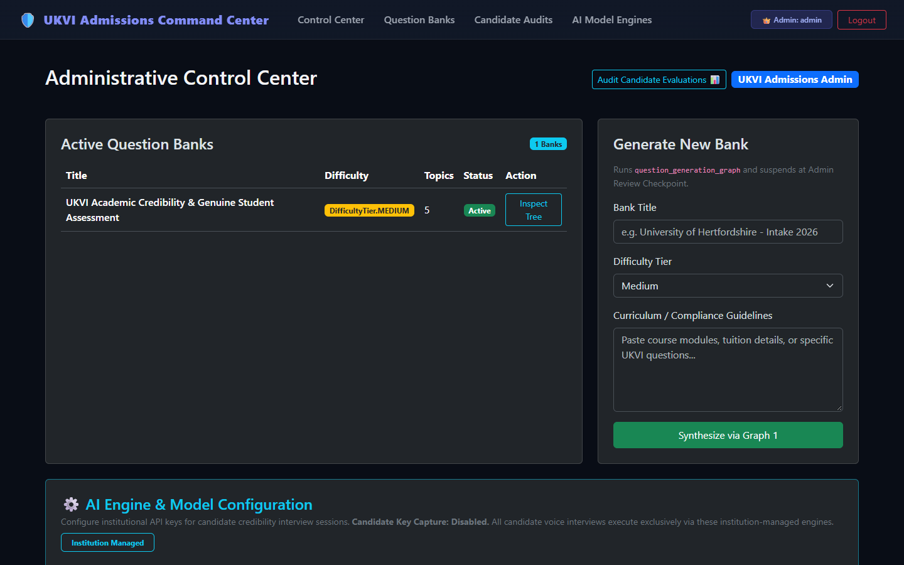
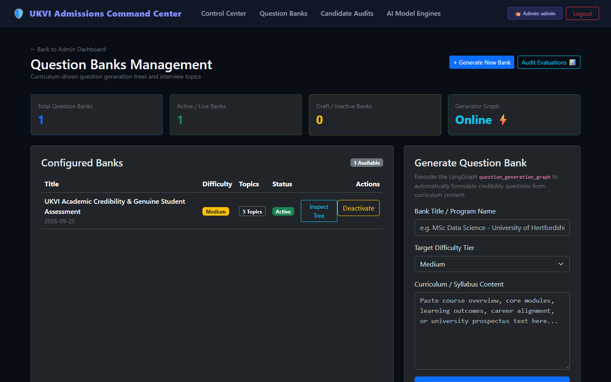
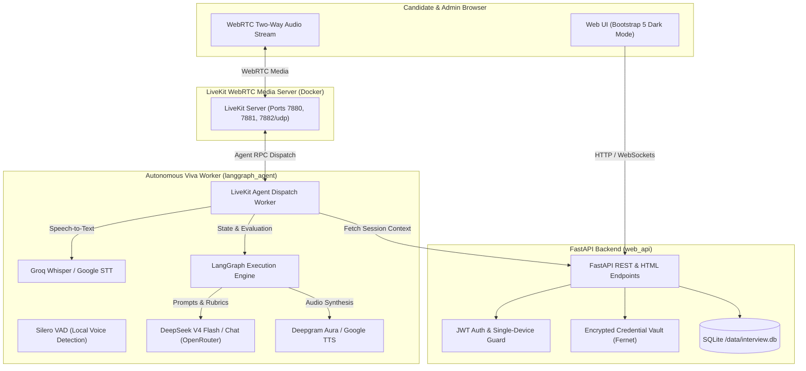

# 🇬🇧 UKVI Credibility & Academic Voice Interview System

[](https://interview.daruntech.cloud/auth/login)
[](https://www.python.org/)
[](https://fastapi.tiangolo.com/)
[](https://livekit.io/)
[](https://github.com/langchain-ai/langgraph)
[](https://docs.docker.com/compose/)

An autonomous, multi-service voice examination system designed to evaluate international applicants for UK higher education institutions and UK Student Visas under the **UKVI Part 9 Genuine Student Credibility Framework**.

The system pairs a **self-hosted LiveKit WebRTC media server** (zero cloud voice API fees) with a **LangGraph state machine** and **FastAPI**, delivering real-time viva audio interviews, objective keyword rubric scoring ($\ge 70\%$ threshold), polite probe re-asking, and instant admissions compliance scorecards.

---

## 🌐 Live Deployment & Demo Access

The platform is deployed live on a high-performance VPS managed via Dokploy and automated GitHub CI/CD:

| Resource | Direct Link | Credentials |
| :--- | :--- | :--- |
| **Live Web Portal** | [https://interview.daruntech.cloud/auth/login](https://interview.daruntech.cloud/auth/login) | Open in browser |
| **Admin Admissions Command Center** | [https://interview.daruntech.cloud/admin](https://interview.daruntech.cloud/admin) | **Username:** `admin` <br> **Password:** `admin` |
| **Student Viva Candidate Portal** | [https://interview.daruntech.cloud/student](https://interview.daruntech.cloud/student) | **Username:** `student` <br> **Password:** `student` |
| **Candidate Registration** | [https://interview.daruntech.cloud/auth/register](https://interview.daruntech.cloud/auth/register) | Create custom profile |
| **Interactive API Documentation** | [https://interview.daruntech.cloud/docs](https://interview.daruntech.cloud/docs) | Swagger OpenAPI UI |

> **Single-Device Lockdown:** For academic security, logging into an account on a new device will immediately terminate any prior session on other hardware.

---

## 📸 Application Screenshots

### 1. Secure Authentication & Device Binding
Hardware-bound session security with automatic session termination upon new device login.



---

### 2. Candidate Dashboard & CAS Confirmation
Students review assigned question banks, configure target university metrics, and verify 28-day maintenance funds.



---

### 3. Real-Time WebRTC Viva Examination Room
Sub-second two-way audio streaming powered by Silero VAD, Groq Whisper STT, and Deepgram Aura / Google TTS with a live transcript feed.



---

### 4. Admissions Command Center
University administrators configure institutional AI engines (DeepSeek V4 Flash, Groq Whisper Turbo, Deepgram Aura) and inspect candidate audit evaluations.



---

### 5. Curriculum-Driven Question Bank Management
Hierarchical curriculum trees featuring main inquiry questions, structured time limits, rubric keywords, and follow-up probes generated by LangGraph.



---

## ⚡ Core Features & Capabilities

- **🎙️ Zero Cloud WebRTC Fees:** Completely self-hosted LiveKit WebRTC server running within Docker. Eliminates prohibitive per-minute cloud communications charges.
- **🧠 LangGraph Multi-Agent Architecture:**
  - `question_gen`: Recursively decomposes syllabus content and compliance mandates into structured question-probe trees.
  - `interview_exec`: Coordinates the live conversational turns, keyword ledger verification, re-ask decision trees, and final composite scorecard generation.
- **🎯 Objective Rubric Scoring ($\ge 70\%$ Rule):** Responses are scored in real time against `expected_answer_keywords`. If a candidate scores $< 70\%$ on their initial attempt, the agent delivers a targeted polite re-ask.
- **🔒 Single-Device Session Lockdown:** Every candidate login generates and enforces a unique `device_id`, instantly revoking any concurrent sessions.
- **🛡️ Institutional AI Vault (AES-GCM / Fernet):** Model credentials (OpenRouter, Groq, Deepgram, Gemini) are securely encrypted at rest. Admin-controlled custody prevents client-side key leakage.
- **⚡ Ultra-Low Latency Pipeline:**
  - **Ear:** Silero VAD (Local CPU) + Groq Whisper Large V3 Turbo STT (~200ms)
  - **Brain:** DeepSeek V4 Flash / Chat via OpenRouter
  - **Mouth:** Deepgram Aura / Google TTS
- **📊 Comprehensive CAS Compliance Reports:** Topic-by-topic percentage breakdowns, keyword hit/miss analytics, strengths, areas for improvement, and formal UKVI visa sponsorship justifications.

---

## 🏗️ System Architecture



---

## 📁 Repository Structure

```text
interviewv2/
├── docker-compose.yml              # Multi-container orchestration (LiveKit, web_api, langgraph_agent)
├── livekit.yaml                    # LiveKit local server network & port configuration
├── pyproject.toml                  # UV workspace configuration & global dependencies
├── main.py                         # Interactive Terminal Viva CLI runner (Voice & Text modes)
├── product_requirement.md          # Formal UKVI specification & system constitution
├── services/
│   ├── web_api/                    # FastAPI Web Application & API Service
│   │   ├── Dockerfile
│   │   └── src/api/
│   │       ├── db/                 # SQLAlchemy models, SQLite migrations, and seed script
│   │       ├── routers/            # Auth, Admin, Student, and WebRTC Token routes
│   │       ├── security/           # JWT, PBKDF2 password hashing, and Fernet vault
│   │       ├── services/           # Question service, bank manager, and credential vault
│   │       ├── static/             # Vendored CSS, JS, and pre-recorded audio instructions
│   │       └── templates/          # Dark-theme Jinja2 HTML templates
│   └── langgraph_agent/            # Autonomous LiveKit Viva Examiner Worker
│       ├── Dockerfile
│       └── src/agent/
│           ├── graphs/             # LangGraph workflows (interview_exec.py, question_gen.py)
│           ├── keyword_ledger.py   # Real-time keyword matching & hit-rate analysis
│           ├── guard.py            # Compliance checks & timeout monitors
│           └── worker.py           # LiveKit real-time voice agent entrypoint
├── docs/                           # Architecture guides, deployment playbooks & screenshots
│   ├── constitution.md             # Spec-driven constitution & development principles
│   ├── fastapi_livekit_architecture.md
│   ├── deployment/                 # Dokploy VPS setup & UFW firewall configuration
│   └── screenshots/                # Real captured system UI screenshots
├── scripts/                        # Automation & testing utilities
│   └── capture_screenshots.py     # Headless Playwright capture suite
└── tests/                          # Automated test suites (Unit, State Machine, WebRTC)
```

---

## 🚀 Quickstart Guide (Local Development)

### Prerequisites

- [Python 3.12+](https://www.python.org/downloads/)
- [`uv`](https://docs.astral.sh/uv/) (Extremely fast Python package manager)
- [Docker & Docker Compose](https://docs.docker.com/get-docker/)

### 1. Clone & Set Up Environment

```bash
git clone https://github.com/promit-bhattacharjee/autonomous-interview.git
cd autonomous-interview

# Copy sample configuration
cp .env.example .env
```

Edit `.env` and provide your API keys:
```env
OPENROUTER_API_KEY=sk-or-v1-your-openrouter-key
GOOGLE_API_KEY=your-gemini-key
JWT_SECRET=your-random-32-char-secret
ENCRYPTION_SECRET_KEY=k2t_9uO8zE1M-1A9_N_v7a4jK0tqL6xW9eP8bX2cR0E=
```

### 2. Run with Docker Compose (Full Stack)

Launch the entire stack (FastAPI web portal, LiveKit WebRTC server, and LangGraph agent):

```bash
docker compose up --build
```

- **Web Portal:** [http://localhost:8000](http://localhost:8000)
- **LiveKit Server:** `ws://localhost:7880`
- **Default Admin Account:** `admin` / `admin`
- **Default Student Account:** `student` / `student`

### 3. Run in Terminal Viva Mode (CLI)

You can also run the viva evaluation directly in your terminal without starting web servers:

```bash
# Install dependencies
uv sync

# Text-only interactive terminal interview
uv run python main.py --text

# Voice-enabled terminal interview (using local microphone and TTS)
uv run python main.py --voice
```

---

## 🚢 Production Deployment (Dokploy & VPS)

For deploying to an Ubuntu VPS using **Dokploy**:

1. **Firewall Setup (Crucial for WebRTC Media Streams):**
   ```bash
   sudo ufw allow 80/tcp
   sudo ufw allow 443/tcp
   sudo ufw allow 7880/tcp
   sudo ufw allow 7881/tcp
   sudo ufw allow 7882/udp     # Critical: WebRTC UDP audio stream
   sudo ufw reload
   ```

2. **Dokploy Configuration:**
   - Create a new **Compose Service** in Dokploy pointing to your repository branch.
   - Set the domain: `interview.yourdomain.com` -> Port `8000` (Enable HTTPS with Let's Encrypt).
   - In Dokploy's **Environment** tab, copy contents from [`.env.dokploy.example`](.env.dokploy.example).
   - Click **Deploy** to launch with zero-downtime rolling updates.

Full step-by-step instructions are available in the [Dokploy Deployment Guide](docs/deployment/dokploy_deployment_guide.md).

---

## 🧪 Testing & Quality Assurance

Run the complete automated test suite covering state transitions, keyword ledgers, relational sequencing, and API endpoints:

```bash
# Run all unit and integration tests
uv run pytest

# Run tests with detailed verbose output
uv run pytest -v -s
```

---

## 📄 License & Credits

This project is developed under the [MIT License](LICENSE).  
Designed for educational compliance, university credibility viva assessments, and UKVI student visa applicant readiness.
