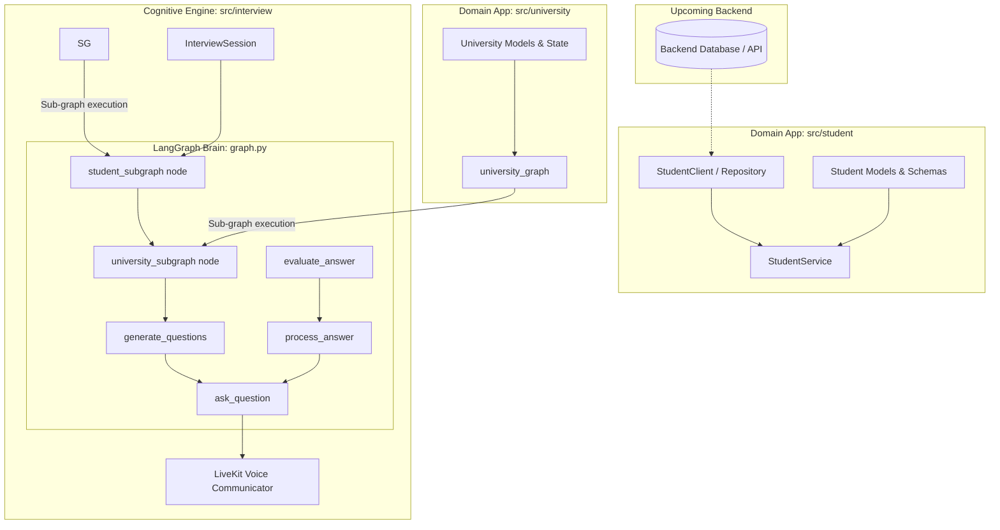

# SPEC-001: Dynamic University & Student Data Integration

| Metadata | Details |
|---|---|
| **Spec ID** | `SPEC-001` |
| **Title** | Dynamic University & Student Domain Applications for Interview State Generation |
| **Status** | `PROPOSED / IN-REVIEW` |
| **Version** | `1.0.0` |
| **Author** | Antigravity AI & Promit Bhattacharjee |
| **Created Date** | 2026-09-08 |
| **Governing Documents** | [product_requirement.md](file:///c:/Users/promi/OneDrive/Desktop/interviewv2/product_requirement.md), [constitution.md](file:///c:/Users/promi/OneDrive/Desktop/interviewv2/docs/constitution.md) |
| **Target Components** | `src/student`, `src/university`, `src/interview` |

---

## 1. Context & Motivation

Currently, the UK Credibility & Academic Voice Interviewer relies on static local mock files:
- `data/students/sample_student.json`
- `data/questions/uk_credibility_questions.txt`

To evolve the system into a production-grade platform where real candidate data and institution profiles are fetched dynamically, we need two decoupled domain applications:
1. **`src/student`**: Dedicated to fetching, validating, and managing Student Profiles, Academic History, English Qualifications, Sponsor Details, and Post-Study Intentions.
2. **`src/university`**: Dedicated to fetching, validating, and managing UK University Profiles, Course Curriculum/Modules, Campus Facilities, Tuition & Living Expense Guidelines, and Credibility Comparison Benchmarks.

When an interview session begins, `src/interview` will dynamically query these two applications, receive structured domain models, and inject them into `InterviewState`. This eliminates all static mock files while providing rich, contextualized grounding for Gemini to generate razor-sharp credibility questions.

> [!NOTE]
> A backend application is currently in development. This spec defines contract-first interfaces and repository adapters so that when the backend is ready, it plugs in seamlessly without modifying the LangGraph interview brain.

---

## 2. System Architecture & Boundaries



---

## 3. Domain Model Specifications (Pydantic V2)

### 3.1. Student Domain (`src/student/models.py`)

```python
from typing import List, Optional
from pydantic import BaseModel, Field

class AcademicQualification(BaseModel):
    degree_title: str = Field(description="Previous degree, e.g., BSc Software Engineering")
    institution: str = Field(description="Graduating institution name")
    cgpa_or_grade: str = Field(description="GPA or classification, e.g., 3.65/4.0")
    graduation_year: Optional[int] = Field(default=None)

class EnglishProficiency(BaseModel):
    test_type: str = Field(description="IELTS, PTE, TOEFL, or Duolingo")
    overall_score: float = Field(description="Overall band score, e.g. 7.5")
    listening: Optional[float] = None
    reading: Optional[float] = None
    writing: Optional[float] = None
    speaking: Optional[float] = None

class FinancialSponsorship(BaseModel):
    tuition_budget_gbp: float = Field(description="Declared tuition coverage in GBP")
    living_cost_budget_gbp: float = Field(description="Declared living expenses budget in GBP")
    sponsor_relationship: str = Field(description="e.g., Self, Father, Mother, Corporate/Government")
    funds_source: str = Field(description="e.g., Bank deposit held > 28 days, Education loan")
    total_available_funds_gbp: float = Field(description="Verified available bank balance in GBP")

class StudentProfile(BaseModel):
    student_id: str = Field(description="Unique Student / CAS Reference ID")
    full_name: str = Field(description="Candidate's full legal name")
    target_country: str = Field(default="United Kingdom")
    target_university_id: str = Field(description="Target institution identifier")
    target_course_id: str = Field(description="Target course identifier")
    academic_history: AcademicQualification
    english_proficiency: EnglishProficiency
    financials: FinancialSponsorship
    post_study_plan: str = Field(description="Career intention upon completion")
    immigrant_history_notes: Optional[str] = Field(default=None, description="Previous visa history")
```

### 3.2. University Domain (`src/university/models.py`)

```python
from typing import List, Optional
from pydantic import BaseModel, Field

class CourseModule(BaseModel):
    module_code: str = Field(description="Module code, e.g. 7COM1076")
    module_title: str = Field(description="Title, e.g. Machine Learning & Neural Networks")
    is_core: bool = Field(default=True)
    credits: int = Field(default=15)
    description: str = Field(description="Syllabus focus and practical lab components")

class UniversityCourse(BaseModel):
    course_id: str = Field(description="Unique course ID, e.g. MSC-AI-ADV")
    course_name: str = Field(description="e.g. MSc Artificial Intelligence with Advanced Research")
    duration_months: int = Field(default=12, description="Duration in months")
    tuition_fee_international_gbp: float = Field(description="Annual international tuition fee")
    modules: List[CourseModule] = Field(default_factory=list)
    career_pathways: List[str] = Field(default_factory=list)

class UniversityProfile(BaseModel):
    university_id: str = Field(description="Institution identifier, e.g. UK-HERTS-01")
    official_name: str = Field(description="e.g. University of Hertfordshire")
    campus_location: str = Field(description="e.g. Hatfield, Hertfordshire (25 mins from London King's Cross)")
    ukvi_maintenance_category: str = Field(default="Outside London", description="Inside London vs Outside London")
    estimated_living_cost_gbp: float = Field(description="Standard UKVI maintenance requirement")
    courses: List[UniversityCourse] = Field(default_factory=list)
    key_facilities: List[str] = Field(default_factory=list, description="e.g. Robotics lab, Bloomberg terminals")
    competitor_comparisons: List[str] = Field(
        default_factory=list, 
        description="Key advantages over alternative UK universities (e.g., lower fees, research labs, industry placement)"
    )
    core_rubrics: List[str] = Field(
        default_factory=list,
        description="Key credibility inspection points mandated for this institution"
    )
```

---

## 4. Service Interfaces (`src/student/service.py` & `src/university/service.py`)

Both applications expose clean, high-level service contracts that decouple data retrieval from data persistence:

### 4.1. Student Application Service
```python
# src/student/service.py
class StudentService:
    def __init__(self, repository: Optional[StudentRepository] = None):
        self.repository = repository or DefaultStudentRepository()

    def get_student_profile(self, student_id: str) -> StudentProfile:
        """Fetches and validates student profile by CAS/Student ID."""
        return self.repository.find_by_id(student_id)
```

### 4.2. University Application Service
```python
# src/university/service.py
class UniversityService:
    def __init__(self, repository: Optional[UniversityRepository] = None):
        self.repository = repository or DefaultUniversityRepository()

    def get_university_profile(self, university_id: str) -> UniversityProfile:
        """Fetches university details, campuses, and accreditation."""
        return self.repository.find_by_id(university_id)

    def get_course_details(self, university_id: str, course_id: str) -> UniversityCourse:
        """Fetches specific syllabus, module lists, and tuition fees."""
        return self.repository.find_course(university_id, course_id)
```

---

## 5. State Integration & Sub-Graph Orchestration

### 5.1. Native Sub-Graph Execution (`src/interview/graph.py`)

Instead of requiring an external glue script (`session_builder.py`), the `interview_graph` directly embeds `student_subgraph` and `university_subgraph` as native nodes in the graph execution:

```
START ──► student_subgraph ──► university_subgraph ──► generate_questions ──► ask_question ──► END
```

1. **`student_subgraph` Node:** Automatically invokes `student_graph` to standardize the incoming candidate payload into `student_profile`.
2. **`university_subgraph` Node:** Automatically invokes `university_graph` to standardize the incoming institution payload into `university_profile`.
3. **`generate_questions` Node:** Consumes the structured `student_profile` and `university_profile` directly from state to dynamically formulate tailored credibility questions.

### 5.2. Grounded Prompt Context

The synthesized context provided to Gemini includes:
1. **Academic Alignment:** Directly cross-references candidate's previous degree (`BSc Software Engineering`) with target modules (`Machine Learning`, `Neural Networks`, `Advanced Research Project`).
2. **Financial Credibility:** Directly compares candidate available funds (`£35,000`) against tuition (`£16,500`) + living costs (`£12,500`), prompting the LLM to inspect fund longevity (28 days rule) and sponsorship.
3. **Institutional Rationale:** Directly feeds university facilities (`Robotics laboratory`) and competitor comparison points into the rubric so questions test genuine institutional choice.

---

## 6. Backend Adaptability Protocol

To ensure seamless integration with the upcoming backend:
- `StudentRepository` and `UniversityRepository` will be defined as abstract base classes (`ABC`).
- In Phase 1 (Local Development), `LocalStudentRepository` and `LocalUniversityRepository` load structured JSON/YAML seed files.
- In Phase 2 (Backend Connection), `HttpBackendStudentRepository` and `HttpBackendUniversityRepository` implement the same interface and fetch data over HTTP/REST or direct database connection without touching a single line of `src/interview`.

---

## 7. Acceptance Criteria

1. **AC-1 (Domain Isolation):** `src/student` and `src/university` must have zero import dependencies on `src/interview` or `langgraph`.
2. **AC-2 (Type Safety):** All student and university data must be strictly validated with Pydantic V2 models.
3. **AC-3 (Zero Mock Hardcoding):** `InterviewSession` accepts `student_id` and `university_id`, dynamically fetching both objects to generate questions.
4. **AC-4 (Rubric Specificity):** Generated interview questions must explicitly reference the target course's real modules and the candidate's actual financial figures.
5. **AC-5 (Backward Compatibility):** Existing tests and debug inspectors continue functioning by default.
