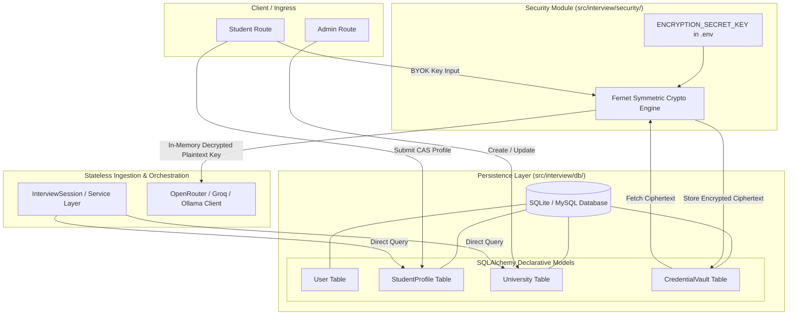

# SPEC-002: Relational Persistence, Credential Vault & Direct DB Ingestion

| Metadata | Details |
|---|---|
| **Spec ID** | `SPEC-002` |
| **Title** | Relational Database Schema, Encrypted Credential Vault, and Direct Stateless Ingestion |
| **Status** | `PROPOSED / IN-REVIEW` |
| **Version** | `1.0.0` |
| **Author** | Antigravity AI & Promit Bhattacharjee |
| **Created Date** | 2026-09-11 |
| **Governing Documents** | [constitution.md v2.1.0](file:///c:/Users/promi/OneDrive/Desktop/interviewv2/docs/constitution.md), [product_requirement.md](file:///c:/Users/promi/OneDrive/Desktop/interviewv2/product_requirement.md) |
| **Target Components** | `src/interview/db/`, `src/interview/security/`, `src/interview/service.py` |

---

## 1. Context & Motivation

Prior iterations of the UK Credibility Voice Interviewer relied on static JSON files in `data/students/` and `data/universities/`, coupled with mock retrieval methods in `src/mock_api.py`. Furthermore, API keys were solely sourced from local `.env` variables without multi-tenant support for student Bring-Your-Own-Key (BYOK) configurations.

To support production workloads and ensure strict compliance with **Article I, Section 2 (Decoupled Architecture)**, **Section 3 (Stateless Ingestion)**, and **Section 5 (Encrypted Credential Vault)** of the System Constitution:
1. **SQLAlchemy Relational ORM:** We introduce declarative models utilizing SQLite for development while strictly adhering to portable standard SQL types so switching to MySQL in production requires zero schema rewriting.
2. **Stateless Direct Ingestion:** Data is fetched directly from database tables as clean dictionaries/JSON objects and passed into services, eliminating unnecessary in-memory state wrapper layers.
3. **Encrypted Credential Vault (BYOK):** Sensitive API keys (OpenRouter, Groq, Ollama, OpenAI) for both global Admin and individual Student BYOK must be encrypted at rest using symmetric encryption (Fernet / AES-256) and decrypted only in-memory during outbound LLM/STT/TTS API calls.

---

## 2. System Architecture & Component Boundaries



---

## 3. Data Schema & Domain Models

### 3.1. Database Declarative Models (`src/interview/db/models.py`)

```python
import enum
from datetime import datetime, timezone
import uuid
from sqlalchemy import (
    Boolean,
    Column,
    DateTime,
    Enum,
    Float,
    ForeignKey,
    Integer,
    String,
    Text,
)
from sqlalchemy.orm import declarative_base, relationship

Base = declarative_base()

def generate_uuid() -> str:
    return str(uuid.uuid4())


class UserRole(str, enum.Enum):
    ADMIN = "admin"
    STUDENT = "student"


class User(Base):
    __tablename__ = "users"

    id = Column(String(36), primary_key=True, default=generate_uuid)
    username = Column(String(80), unique=True, nullable=False, index=True)
    email = Column(String(120), unique=True, nullable=False, index=True)
    hashed_password = Column(String(255), nullable=False)
    role = Column(Enum(UserRole), default=UserRole.STUDENT, nullable=False)
    active_device_id = Column(String(128), nullable=True)  # Single-device session lockdown
    last_login_at = Column(DateTime, nullable=True)
    is_active = Column(Boolean, default=True, nullable=False)
    created_at = Column(DateTime, default=lambda: datetime.now(timezone.utc))

    student_profile = relationship("StudentProfile", back_populates="user", uselist=False)
    credentials = relationship("CredentialVault", back_populates="user")


class University(Base):
    __tablename__ = "universities"

    id = Column(String(36), primary_key=True, default=generate_uuid)
    university_code = Column(String(50), unique=True, nullable=False, index=True)
    official_name = Column(String(200), nullable=False)
    campus_location = Column(String(200), nullable=False)
    tuition_fee_gbp = Column(Float, nullable=False, default=0.0)
    living_cost_guideline_gbp = Column(Float, nullable=False, default=0.0)
    target_course = Column(String(200), nullable=False)
    degree_level = Column(String(50), default="Postgraduate", nullable=False)
    duration_months = Column(Integer, default=12, nullable=False)
    core_modules_json = Column(Text, default="[]", nullable=False)
    campus_facilities_json = Column(Text, default="[]", nullable=False)
    competitor_differentiators_json = Column(Text, default="[]", nullable=False)
    compliance_rubrics_json = Column(Text, default="[]", nullable=False)
    created_at = Column(DateTime, default=lambda: datetime.now(timezone.utc))

    students = relationship("StudentProfile", back_populates="selected_university")
    question_banks = relationship("QuestionBank", back_populates="university")


class StudentProfile(Base):
    __tablename__ = "student_profiles"

    id = Column(String(36), primary_key=True, default=generate_uuid)
    user_id = Column(String(36), ForeignKey("users.id"), unique=True, nullable=False)
    selected_university_id = Column(String(36), ForeignKey("universities.id"), nullable=True)
    full_name = Column(String(150), nullable=False)
    academic_background = Column(Text, default="", nullable=False)
    english_proficiency = Column(String(100), default="", nullable=False)
    tuition_fee_gbp = Column(Float, default=0.0, nullable=False)
    living_cost_gbp = Column(Float, default=0.0, nullable=False)
    available_funds_gbp = Column(Float, default=0.0, nullable=False)
    sponsor_details = Column(Text, default="", nullable=False)
    post_study_plan = Column(Text, default="", nullable=False)
    created_at = Column(DateTime, default=lambda: datetime.now(timezone.utc))
    updated_at = Column(DateTime, default=lambda: datetime.now(timezone.utc), onupdate=lambda: datetime.now(timezone.utc))

    user = relationship("User", back_populates="student_profile")
    selected_university = relationship("University", back_populates="students")


class CredentialVault(Base):
    __tablename__ = "credential_vault"

    id = Column(String(36), primary_key=True, default=generate_uuid)
    user_id = Column(String(36), ForeignKey("users.id"), nullable=True, index=True)
    provider = Column(String(50), nullable=False, default="openrouter")  # openrouter, groq, ollama, openai
    base_url = Column(String(255), nullable=True)
    thinking_model = Column(String(100), default="deepseek/deepseek-v4-flash-0731", nullable=False)
    tts_model = Column(String(100), default="gemini-2.5-flash-preview-tts", nullable=False)
    stt_model = Column(String(100), default="gemini-3.6-flash", nullable=False)
    encrypted_api_key = Column(Text, nullable=False)
    created_at = Column(DateTime, default=lambda: datetime.now(timezone.utc))

    user = relationship("User", back_populates="credentials")
```

---

## 4. Security & Encryption Vault Protocol (`src/interview/security/vault.py`)

### 4.1. Cryptographic Primitive
- **Algorithm:** Fernet symmetric encryption built on top of AES-128-CBC with PKCS7 padding and HMAC-SHA256 authentication.
- **Key Generation:** Sourced from `ENCRYPTION_SECRET_KEY` in `.env`. If unset during startup, raises an explicit configuration error.

```python
import base64
import os
from cryptography.fernet import Fernet

def get_cipher() -> Fernet:
    key = os.getenv("ENCRYPTION_SECRET_KEY")
    if not key:
        raise ValueError("ENCRYPTION_SECRET_KEY environment variable is required.")
    return Fernet(key.encode() if isinstance(key, str) else key)

def encrypt_api_key(plaintext_key: str) -> str:
    """Encrypts raw API key into Fernet ciphertext token."""
    if not plaintext_key:
        return ""
    cipher = get_cipher()
    return cipher.encrypt(plaintext_key.strip().encode("utf-8")).decode("utf-8")

def decrypt_api_key(ciphertext: str) -> str:
    """Decrypts Fernet ciphertext into raw API key in-memory."""
    if not ciphertext:
        return ""
    cipher = get_cipher()
    return cipher.decrypt(ciphertext.encode("utf-8")).decode("utf-8")

def mask_api_key(raw_key: str) -> str:
    """Formats key for safe UI display, e.g. sk-...94f2."""
    if not raw_key or len(raw_key) < 8:
        return "****"
    return f"{raw_key[:3]}...{raw_key[-4:]}"
```

### 4.2. JWT Token Service & Single-Device Lockdown (`src/interview/security/auth.py`)
- **Lightweight Stateless Tokens:** Cryptographically signed with HMAC-SHA256 (`HS256`) using `JWT_SECRET_KEY`.
- **Claims Payload:** Contains `sub` (User UUID), `username`, `role` (`admin`/`student`), `device_id`, and `exp` (12-hour session expiry).
- **Single-Device Enforcement:** On login, the client provides or is issued a unique `device_id`. The server records this `device_id` in `User.active_device_id`.
- Every protected route verifies that `token["device_id"] == db_user.active_device_id`. If a user logs in from Device B, Device A's token becomes instantly invalid (HTTP 401 Unauthorized: "Account active on another device").

```python
import jwt
from datetime import datetime, timedelta, timezone
from fastapi import HTTPException, Security, status
from fastapi.security import HTTPBearer, HTTPAuthorizationCredentials

JWT_SECRET = os.getenv("JWT_SECRET_KEY", "dev-jwt-insecure-secret-key-32chars!!")
ALGORITHM = "HS256"

def create_access_token(user_id: str, username: str, role: str, device_id: str, expires_delta: timedelta = timedelta(hours=12)) -> str:
    payload = {
        "sub": user_id,
        "username": username,
        "role": role,
        "device_id": device_id,
        "exp": datetime.now(timezone.utc) + expires_delta,
        "iat": datetime.now(timezone.utc),
    }
    return jwt.encode(payload, JWT_SECRET, algorithm=ALGORITHM)

def verify_active_device(token: str, db: Session) -> User:
    try:
        payload = jwt.decode(token, JWT_SECRET, algorithms=[ALGORITHM])
    except jwt.PyJWTError:
        raise HTTPException(status_code=status.HTTP_401_UNAUTHORIZED, detail="Invalid token")

    user_id = payload.get("sub")
    token_device_id = payload.get("device_id")
    user = db.query(User).filter(User.id == user_id, User.is_active == True).first()
    if not user:
        raise HTTPException(status_code=status.HTTP_401_UNAUTHORIZED, detail="User not found")

    if user.active_device_id != token_device_id:
        raise HTTPException(
            status_code=status.HTTP_401_UNAUTHORIZED,
            detail="Session terminated. Your account has been logged in from another device."
        )
    return user
```

---

## 5. Stateless Direct Ingestion Contract

To satisfy **Constitution Article I, Section 3**, queries returning data to the LangGraph `InterviewSession` must return plain dictionaries without intermediate wrapper objects:

```python
def get_student_cas_payload(db: Session, student_user_id: str) -> dict:
    profile = db.query(StudentProfile).filter(StudentProfile.user_id == student_user_id).first()
    if not profile:
        raise ValueError(f"Student profile for user '{student_user_id}' not found.")
    return {
        "student_id": profile.user.username,
        "full_name": profile.full_name,
        "target_country": "United Kingdom",
        "target_university": profile.selected_university.official_name if profile.selected_university else "",
        "target_course": profile.selected_university.target_course if profile.selected_university else "",
        "academic_background": profile.academic_background,
        "english_proficiency": profile.english_proficiency,
        "tuition_fee_gbp": profile.tuition_fee_gbp,
        "living_cost_gbp": profile.living_cost_gbp,
        "available_funds_gbp": profile.available_funds_gbp,
        "sponsor_details": profile.sponsor_details,
        "post_study_plan": profile.post_study_plan,
    }
```

---

---

## 6. Service / Repository Pattern & Dual Ingress Ingestion

To achieve sub-millisecond voice processing latency while keeping frontend rendering modular, question bank relational queries follow the **Industry Standard Service / Repository Pattern**:

```
                   ┌──────────────────────────────────────┐
                   │         DATABASE (SQLite / MySQL)    │
                   └──────────────────▲───────────────────┘
                                      │ SQLAlchemy ORM
                   ┌──────────────────┴───────────────────┐
                   │        SERVICE / REPOSITORY LAYER    │
                   │ (src/interview/services/question_service.py) │
                   │  - get_topics_for_bank(db, bank_id)  │
                   │  - get_questions_for_topic(db, id)   │
                   │  - get_followups_for_question(db, id)│
                   │  - get_assigned_bank_for_user(db, id)│
                   └──────────▲────────────────▲──────────┘
                              │                │
            In-Process Python │ Direct Call    │ In-Process Python Direct Call
            (Zero HTTP Hop)   │                │ (Zero HTTP Hop, <0.1ms)
    ┌─────────────────────────┴────┐      ┌────┴─────────────────────────┐
    │     FastAPI Router           │      │     LangGraph Agent / Tools  │
    │ (src/interview/api/routes/)  │      │ (src/interview/tools/fetchers)
    │                              │      │                              │
    │  @router.get("/api/topics")  │      │  @tool                       │
    │  def api_topics(db):         │      │  def fetch_topics(bank_id):  │
    │      return get_topics(db)   │      │      return get_topics(db)   │
    └──────────────▲───────────────┘      └──────────────────────────────┘
                   │
         HTTP/JSON │ (Network Boundary)
                   │
    ┌──────────────┴───────────────┐
    │      Web Browser Client      │
    │    (Admin / Student UI)      │
    └──────────────────────────────┘
```

### 6.1. The Service / Repository Layer (`src/interview/services/question_service.py`)
This layer is the **single source of truth** for all database queries. It contains pure Python functions that accept a SQLAlchemy `Session` and return structured dictionaries:

```python
import json
from typing import Optional
from sqlalchemy.orm import Session
from src.interview.db.models import (
    TopicRecord,
    QuestionRecord,
    FollowupRecord,
    QuestionAssignment,
    StudentProfile,
)


def get_topics_for_bank(db: Session, bank_id: str) -> list[dict]:
    """Fetches all topics belonging to a QuestionBank ordered by sequence."""
    topics = (
        db.query(TopicRecord)
        .filter(TopicRecord.bank_id == bank_id)
        .order_by(TopicRecord.order)
        .all()
    )
    return [
        {"topic_id": t.id, "name": t.name, "description": t.description, "order": t.order}
        for t in topics
    ]


def get_questions_for_topic(db: Session, topic_id: str) -> list[dict]:
    """Fetches all questions belonging to a specific topic."""
    questions = (
        db.query(QuestionRecord)
        .filter(QuestionRecord.topic_id == topic_id)
        .order_by(QuestionRecord.order)
        .all()
    )
    return [
        {
            "question_id": q.id,
            "question_text": q.question_text,
            "expected_time_to_ans": q.expected_time_to_ans,
            "expected_answer_keywords": json.loads(q.expected_answer_keywords_json),
            "order": q.order,
        }
        for q in questions
    ]


def get_followups_for_question(db: Session, question_id: str) -> list[dict]:
    """Fetches all follow-up probes nested under a question."""
    followups = (
        db.query(FollowupRecord)
        .filter(FollowupRecord.question_id == question_id)
        .order_by(FollowupRecord.order)
        .all()
    )
    return [
        {
            "followup_id": f.id,
            "followup_text": f.followup_text,
            "expected_time_to_ans": f.expected_time_to_ans,
            "expected_answer_keywords": json.loads(f.expected_answer_keywords_json),
            "order": f.order,
        }
        for f in followups
    ]


def get_assigned_bank_for_user(db: Session, user_id: str) -> Optional[dict]:
    """
    Resolves the single active QuestionBank assigned to a student.
    Enforces the rule: One candidate can have only ONE active assigned question set at a time.
    Returns None if no question set is assigned (blocking interview creation).
    """
    student = db.query(StudentProfile).filter(StudentProfile.user_id == user_id).first()
    if not student:
        return None

    # Check for direct candidate assignment first
    assignment = db.query(QuestionAssignment).filter(
        QuestionAssignment.student_id == student.id,
        QuestionAssignment.is_excluded == False,
    ).first()

    # Fallback to global assignment if not explicitly excluded
    if not assignment:
        is_excluded = db.query(QuestionAssignment).filter(
            QuestionAssignment.student_id == student.id,
            QuestionAssignment.is_excluded == True,
        ).first()
        if not is_excluded:
            assignment = db.query(QuestionAssignment).filter(
                QuestionAssignment.student_id == None,
                QuestionAssignment.is_excluded == False,
            ).first()

    if not assignment or not assignment.question_bank or not assignment.question_bank.is_active:
        return None

    bank = assignment.question_bank
    return {
        "bank_id": bank.id,
        "university_id": bank.university_id,
        "difficulty": bank.difficulty.value,
        "title": bank.title,
        "topics": get_topics_for_bank(db, bank.id),
    }
```

### 6.2. LangGraph Tool Ingestion (`src/interview/tools/relational_fetchers.py`)
In-process AI tools invoke the Service Layer directly using local database sessions. **This avoids HTTP loopback roundtrips entirely**, executing in `< 0.1ms`:

```python
from langchain_core.tools import tool
from src.interview.db.session import get_db_session
from src.interview.services import question_service


@tool
def fetch_topics(bank_id: str) -> list[dict]:
    """Fetches all topics belonging to a QuestionBank ordered by sequence."""
    with get_db_session() as db:
        return question_service.get_topics_for_bank(db, bank_id)


@tool
def fetch_questions(topic_id: str) -> list[dict]:
    """Fetches all questions belonging to a specific topic."""
    with get_db_session() as db:
        return question_service.get_questions_for_topic(db, topic_id)


@tool
def fetch_followups(question_id: str) -> list[dict]:
    """Fetches all follow-up probes nested under a question."""
    with get_db_session() as db:
        return question_service.get_followups_for_question(db, question_id)


@tool
def get_user_assigned_questions(user_id: str) -> dict:
    """Resolves the single active QuestionBank assigned to a student candidate."""
    with get_db_session() as db:
        bank = question_service.get_assigned_bank_for_user(db, user_id)
        return bank or {}
```

### 6.3. External FastAPI Endpoints (`src/interview/api/routers/relational_routes.py`)
Browser clients and admin web screens consume the exact same Service Layer via standard HTTP:

```python
from fastapi import APIRouter, Depends, HTTPException
from sqlalchemy.orm import Session
from src.interview.db.session import get_db
from src.interview.services import question_service

router = APIRouter(prefix="/api", tags=["Relational Bank Navigation"])


@router.get("/banks/{bank_id}/topics")
def api_get_topics(bank_id: str, db: Session = Depends(get_db)):
    return question_service.get_topics_for_bank(db, bank_id)


@router.get("/topics/{topic_id}/questions")
def api_get_questions(topic_id: str, db: Session = Depends(get_db)):
    return question_service.get_questions_for_topic(db, topic_id)


@router.get("/questions/{question_id}/followups")
def api_get_followups(question_id: str, db: Session = Depends(get_db)):
    return question_service.get_followups_for_question(db, question_id)


@router.get("/students/{user_id}/assigned-questions")
def api_get_assigned_questions(user_id: str, db: Session = Depends(get_db)):
    bank = question_service.get_assigned_bank_for_user(db, user_id)
    if not bank:
        raise HTTPException(status_code=404, detail="No active question bank assigned to this student.")
    return bank
```

---

## 7. Acceptance Criteria

- **AC-2.1 (Zero Plaintext Leakage):** Plaintext API keys must never appear in SQLite files, log files, or terminal traces.
- **AC-2.2 (Symmetric Roundtrip):** Encrypted keys must decrypt back to exact plaintext strings in-memory.
- **AC-2.3 (MySQL Compatibility):** All table definitions must use portable SQL types compatible with both SQLite and MySQL.
- **AC-2.4 (Ingestion Performance):** Loading student & university payloads must complete in under 5ms without intermediate object instantiations.
- **AC-2.5 (Modular Tool Fetching):** `fetch_topics`, `fetch_questions`, and `fetch_followups` return isolated, clean JSON arrays.
- **AC-2.6 (Single Active Bank Invariant):** `get_user_assigned_questions` returns at most ONE active question bank for a candidate.

---

## 8. Tasks & Phased Implementation

- [ ] **Task 2.1:** Create `src/interview/db/session.py` with SQLAlchemy engine, `SessionLocal`, and SQLite/MySQL connection URL resolver.
- [ ] **Task 2.2:** Define declarative models in `src/interview/db/models.py`.
- [ ] **Task 2.3:** Implement `src/interview/security/vault.py` with Fernet encryption, decryption, and key masking.
- [ ] **Task 2.4:** Implement Service / Repository layer in `src/interview/services/question_service.py`.
- [ ] **Task 2.5:** Implement tool fetchers in `src/interview/tools/relational_fetchers.py` and REST endpoints in `src/interview/api/routers/relational_routes.py`.
- [ ] **Task 2.6:** Write unit tests for models, CRUD operations, cryptographic vault, service layer, and tool fetchers in `tests/db/test_models_and_vault.py`.
