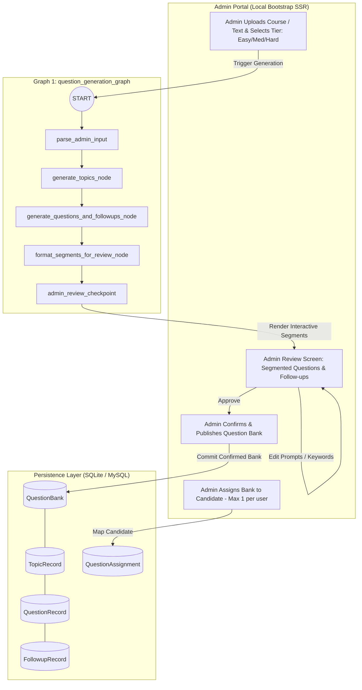

# SPEC-003: Admin Portal & Multi-Tier Question Bank Management

| Metadata | Details |
|---|---|
| **Spec ID** | `SPEC-003` |
| **Title** | SSR Admin Portal, Multi-Tier Question Bank Lifecycle (`Easy`/`Medium`/`Hard`), and Candidate Assignment Matrix |
| **Status** | `PROPOSED / IN-REVIEW` |
| **Version** | `1.0.0` |
| **Author** | Antigravity AI & Promit Bhattacharjee |
| **Created Date** | 2026-09-11 |
| **Governing Documents** | [constitution.md v2.1.0](file:///c:/Users/promi/OneDrive/Desktop/interviewv2/docs/constitution.md), [product_requirement.md](file:///c:/Users/promi/OneDrive/Desktop/interviewv2/product_requirement.md) |
| **Target Components** | `src/interview/db/`, `src/interview/admin/`, `src/interview/templates/admin/` |

---

## 1. Context & Motivation

University admissions and UKVI credibility question patterns operate over prolonged cycles (typically 4–5 months). In earlier iterations, interview questions were regenerated from scratch or loaded from static flat text files without versioning, persistence, or difficulty tiers.

To satisfy **Constitution Article I, Section 4 (Persistent Question Bank Governance)** and **Section 9 (Local Bootstrap SSR)**:
1. **Multi-Tier Persistence:** Question Banks are divided into three standardized difficulty tiers: `Easy`, `Medium`, and `Hard`.
2. **Cache-First Ingestion:** When an interview initiates, the system checks SQLite. If a question bank matching the university and difficulty tier exists, the system retrieves it directly, **bypassing LLM generation completely**.
3. **Candidate Assignment Matrix:** A Question Bank can be mapped to all students by default, or mapped to specific cohorts with inclusion/exclusion filters.
4. **Admin Authoring:** Administrators can view the hierarchy (`Topic` $\to$ `Question` $\to$ `Followup`), edit questions, tweak expected rubric keywords, and audit candidate evaluations.
5. **Local Bootstrap SSR:** Interfaces are built using server-rendered Jinja2 templates styled with local Bootstrap assets.

---

## 2. Technical Architecture: The Decoupled Question Generation Graph

To prevent mixing generation with real-time execution, question creation is entirely isolated into its own dedicated graph: `question_generation_graph` (`src/interview/question_graph.py`).



### 2.1. The Admin Review Checkpoint & Segment Editing
1. **Segmentation:** The `question_generation_graph` divides the AI-generated curriculum into discrete, editable segments: Topics, Primary Questions, and Follow-up Probes.
2. **Admin Screen Interaction:** The admin inspects each segment. The admin can:
   - Edit the question wording.
   - Add, remove, or modify follow-up probes.
   - Refine expected answer keywords and time limits.
3. **Confirmation:** The admin confirms the question set. The status is set to `is_confirmed = True` and committed to SQLite.
4. **Pre-requisite Gate:** **No interview will be generated** for any candidate until an approved question bank is confirmed and assigned to that candidate.

---

## 3. Database Schema: Question Bank & Assignment Matrix

```python
import enum
from sqlalchemy import (
    Boolean,
    Column,
    DateTime,
    Enum,
    Float,
    ForeignKey,
    Integer,
    String,
    Text,
)
from sqlalchemy.orm import relationship
from src.interview.db.models import Base, generate_uuid


class QuestionDifficulty(str, enum.Enum):
    EASY = "Easy"
    MEDIUM = "Medium"
    HARD = "Hard"


class QuestionBank(Base):
    __tablename__ = "question_banks"

    id = Column(String(36), primary_key=True, default=generate_uuid)
    university_id = Column(String(36), ForeignKey("universities.id"), nullable=False)
    difficulty = Column(Enum(QuestionDifficulty), default=QuestionDifficulty.MEDIUM, nullable=False)
    version = Column(Integer, default=1, nullable=False)
    title = Column(String(200), nullable=False)
    description = Column(Text, default="", nullable=False)
    is_active = Column(Boolean, default=True, nullable=False)
    created_at = Column(DateTime, nullable=False)
    updated_at = Column(DateTime, nullable=False)

    university = relationship("University", back_populates="question_banks")
    topics = relationship("TopicRecord", back_populates="question_bank", cascade="all, delete-orphan", order_by="TopicRecord.order")
    assignments = relationship("QuestionAssignment", back_populates="question_bank", cascade="all, delete-orphan")


class TopicRecord(Base):
    __tablename__ = "topic_records"

    id = Column(String(36), primary_key=True, default=generate_uuid)
    bank_id = Column(String(36), ForeignKey("question_banks.id"), nullable=False)
    name = Column(String(150), nullable=False)
    description = Column(Text, default="", nullable=False)
    order = Column(Integer, default=1, nullable=False)

    question_bank = relationship("QuestionBank", back_populates="topics")
    questions = relationship("QuestionRecord", back_populates="topic", cascade="all, delete-orphan", order_by="QuestionRecord.order")


class QuestionRecord(Base):
    __tablename__ = "question_records"

    id = Column(String(36), primary_key=True, default=generate_uuid)
    topic_id = Column(String(36), ForeignKey("topic_records.id"), nullable=False)
    question_text = Column(Text, nullable=False)
    expected_time_to_ans = Column(Integer, default=45, nullable=False)
    expected_answer_keywords_json = Column(Text, default="[]", nullable=False)
    order = Column(Integer, default=1, nullable=False)

    topic = relationship("TopicRecord", back_populates="questions")
    followups = relationship("FollowupRecord", back_populates="question", cascade="all, delete-orphan", order_by="FollowupRecord.order")


class FollowupRecord(Base):
    __tablename__ = "followup_records"

    id = Column(String(36), primary_key=True, default=generate_uuid)
    question_id = Column(String(36), ForeignKey("question_records.id"), nullable=False)
    followup_text = Column(Text, nullable=False)
    expected_time_to_ans = Column(Integer, default=30, nullable=False)
    expected_answer_keywords_json = Column(Text, default="[]", nullable=False)
    order = Column(Integer, default=1, nullable=False)

    question = relationship("QuestionRecord", back_populates="followups")


class QuestionAssignment(Base):
    __tablename__ = "question_assignments"

    id = Column(String(36), primary_key=True, default=generate_uuid)
    bank_id = Column(String(36), ForeignKey("question_banks.id"), nullable=False)
    student_id = Column(String(36), ForeignKey("student_profiles.id"), nullable=True) # Null = Applied to All Students
    is_excluded = Column(Boolean, default=False, nullable=False) # True = Explicitly excluded

    question_bank = relationship("QuestionBank", back_populates="assignments")
```

---

## 4. Cache-First Question Retrieval & Ingestion Protocol

When a candidate initiates an interview:

```python
def resolve_interview_questions(db: Session, university_id: str, student_profile_id: str, difficulty: str = "Medium") -> dict:
    """
    1. Check for student-specific assignment or exclusion.
    2. Check if a QuestionBank exists for the specified university and difficulty.
    3. If found: Return cached SQLite tree. (Zero LLM token consumption).
    4. If not found: Trigger LangGraph question generator node, commit tree to SQLite, and return.
    """
    # 1. Check exclusion
    excluded = db.query(QuestionAssignment).filter(
        QuestionAssignment.student_id == student_profile_id,
        QuestionAssignment.is_excluded == True,
    ).first()

    # 2. Check cached question bank
    query = db.query(QuestionBank).filter(
        QuestionBank.university_id == university_id,
        QuestionBank.difficulty == difficulty,
        QuestionBank.is_active == True,
    )
    bank = query.first()

    if bank and bank.topics:
        # Return SQLite cached structure formatted directly for LangGraph InterviewState
        return format_bank_for_interview(bank)

    # 3. Generate via LLM Brain & Persist
    new_bank = generate_and_persist_question_bank(db, university_id, difficulty)
    return format_bank_for_interview(new_bank)
```

---

## 5. Admin Portal Views (Local Bootstrap SSR)

1. **University Management (`/admin/universities`):**
   - Create and edit UK universities, tuition fees, 9-month maintenance requirements, course modules, and UKVI compliance rubrics.
2. **Question Bank Explorer (`/admin/question-banks`):**
   - Table of all Question Banks grouped by institution and difficulty badge (`[Easy]`, `[Medium]`, `[Hard]`).
   - "Generate New Bank" button with target course & difficulty selector.
3. **Tree-View Question Editor (`/admin/question-banks/{id}/edit`):**
   - Interactive hierarchical view of Topics, Questions, and Follow-up probes.
   - Inline modal to edit question prompts, adjust response timers, and add/remove expected rubric keywords.
4. **Candidate Assignment Matrix (`/admin/question-banks/{id}/assignments`):**
   - Toggle "Global (All Candidates)".
   - Multi-select candidate list with "Include" and "Exclude" flags.
5. **Evaluation Audit & Reports (`/admin/evaluations`):**
   - View candidate scorecards, accuracy breakdown, strengths, areas for improvement, and UKVI visa justification report.
6. **AI Engine & 3-Model Configuration (Institution Defaults):**
   - Configures the 3 core AI models for candidate sessions without personal BYOK keys:
     - **Thinking Model (LLM Brain):** Reasoner evaluating responses and generating structured prompts (OpenRouter, Gemini, OpenAI, DeepSeek, Ollama, Grok).
     - **Speech-to-Text (STT) Model:** Real-time microphone audio transcription (Google Gemini STT, OpenAI Whisper, Deepgram, Groq Whisper).
     - **Text-to-Speech (TTS) Model:** Professional British interviewer audio synthesizer (Google Gemini TTS, OpenAI TTS, ElevenLabs, Cartesia).
   - **Commercial Prototype Mechanism:** Candidates without BYOK use these institution-provided keys and can be billed based on model consumption; candidates with BYOK keys bypass fees completely.
   - Endpoints: `POST /admin/credentials` (saves/upserts encrypted key), `POST /admin/credentials/delete` (reverts to `.env` fallback).

---

## 6. Acceptance Criteria

- **AC-3.1 (Cache-First Token Efficiency):** An interview initiated for an existing bank must execute without generating questions or making external LLM calls for question generation.
- **AC-3.2 (Authoritative Admin Modification):** Modifications to question text or rubric keywords saved by an Admin must immediately reflect in subsequent candidate interviews.
- **AC-3.3 (Candidate Exclusion Enforcement):** Excluded students must not receive or be routed to excluded question banks.
- **AC-3.4 (Bootstrap SSR Integrity):** All admin views must render completely using local Bootstrap assets (`bootstrap.min.css`, `bootstrap.bundle.min.js`) without external CDN requests.
- **AC-3.5 (3-Model Admin Provisioning):** The Admin must be able to configure and revert each of the 3 model types (Thinking, STT, TTS) independently, with keys securely encrypted in the CredentialVault.

---

## 7. Tasks & Phased Implementation

- [ ] **Task 3.1:** Define `QuestionBank`, `TopicRecord`, `QuestionRecord`, `FollowupRecord`, and `QuestionAssignment` models in `src/interview/db/models.py`.
- [ ] **Task 3.2:** Implement question repository with cache-first lookup logic in `src/interview/db/question_repo.py`.
- [ ] **Task 3.3:** Vendor local Bootstrap assets into `src/interview/static/vendor/bootstrap/`.
- [ ] **Task 3.4:** Create Admin base layout, navigation, and views in `src/interview/templates/admin/`.
- [ ] **Task 3.5:** Implement FastAPI admin router endpoints in `src/interview/admin/routes.py`.
- [ ] **Task 3.6:** Write unit tests for question bank caching, candidate assignments, and admin modification workflows.
