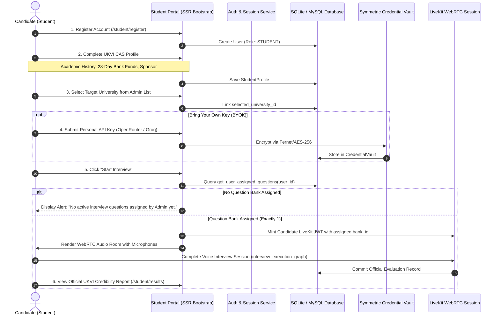

# SPEC-004: Student Portal & UKVI CAS Profile Workflow

| Metadata | Details |
|---|---|
| **Spec ID** | `SPEC-004` |
| **Title** | SSR Student Portal, CAS Credibility Profile Ingestion, BYOK Configuration, and Scorecard Viewer |
| **Status** | `PROPOSED / IN-REVIEW` |
| **Version** | `1.0.0` |
| **Author** | Antigravity AI & Promit Bhattacharjee |
| **Created Date** | 2026-09-11 |
| **Governing Documents** | [constitution.md v2.1.0](file:///c:/Users/promi/OneDrive/Desktop/interviewv2/docs/constitution.md), [product_requirement.md](file:///c:/Users/promi/OneDrive/Desktop/interviewv2/product_requirement.md) |
| **Target Components** | `src/interview/student/`, `src/interview/templates/student/`, `src/interview/db/` |

---

## 1. Context & Motivation

International candidates applying for UK student visas and university admissions require an intuitive, secure portal where they can create an account, submit their Confirmation of Acceptance for Studies (CAS) credentials, select their intended institution, optionally configure their own AI API credentials (BYOK), launch real-time WebRTC credibility interviews, and review their comprehensive performance scorecards.

To comply with **Constitution Article I, Section 3 (Stateless Ingestion)**, **Section 5 (Encrypted Credential Vault)**, and **Section 9 (Local Bootstrap SSR)**:
1. **Self-Service Onboarding:** Students independently register and manage their accounts.
2. **Standardized CAS Ingestion:** Academic, financial (UKVI 28-day maintenance funds rule), and sponsor details are captured and validated via Pydantic v2 schemas.
3. **Institutional Boundary Enforcement:** Students select from Admin-approved UK universities; they are strictly prohibited from altering institutional parameters, course modules, or fee guidelines.
4. **Encrypted BYOK Support:** Students can optionally supply personal OpenRouter, Groq, or Ollama keys, encrypted via the security vault.
5. **UKVI Credibility Scorecard:** Once completed, candidates view their official evaluation report, rubric achievements, and visa justification summaries.

---

## 2. Technical Architecture & Student Journey



---

## 3. Data Ingestion & Pydantic Validation Models

```python
from typing import Optional
from pydantic import BaseModel, Field, field_validator


class StudentRegistrationSchema(BaseModel):
    username: str = Field(..., min_length=3, max_length=50)
    email: str = Field(..., min_length=5, max_length=120)
    password: str = Field(..., min_length=8)
    full_name: str = Field(..., min_length=2, max_length=150)
    device_id: str = Field(..., min_length=8, description="Unique client hardware/browser device identifier")


class StudentLoginSchema(BaseModel):
    username_or_email: str = Field(..., min_length=3)
    password: str = Field(..., min_length=8)
    device_id: str = Field(..., min_length=8, description="Unique client hardware/browser device identifier")


class StudentCASProfileSchema(BaseModel):
    selected_university_id: str = Field(..., min_length=1, description="Selected UK University ID")
    academic_background: str = Field(..., min_length=10, description="Previous degree, major, CGPA, and graduating institution")
    english_proficiency: str = Field(..., min_length=3, description="Test type and score, e.g. IELTS 7.5, PTE 68")
    tuition_fee_gbp: float = Field(..., gt=0.0, description="Annual tuition fee in GBP")
    living_cost_gbp: float = Field(..., gt=0.0, description="UKVI 9-month living maintenance in GBP")
    available_funds_gbp: float = Field(..., gt=0.0, description="Total verified bank deposit in GBP")
    sponsor_details: str = Field(..., min_length=5, description="Sponsorship source and 28-day holding verification")
    post_study_plan: str = Field(..., min_length=10, description="Career plans and ties to home country")

    @field_validator("available_funds_gbp")
    @classmethod
    def validate_funds_coverage(cls, v: float, info) -> float:
        tuition = info.data.get("tuition_fee_gbp", 0.0)
        living = info.data.get("living_cost_gbp", 0.0)
        required = tuition + living
        if v < required:
            # Not an automatic rejection, but flag for credibility rubric probing
            pass
        return v


class StudentBYOKSchema(BaseModel):
    provider: str = Field(default="openrouter", description="openrouter, groq, or ollama")
    base_url: Optional[str] = Field(default=None)
    api_key: str = Field(..., min_length=10, description="Personal API Key")
```

---

## 4. Student Portal Views (Local Bootstrap SSR)

1. **Authentication Views (`/student/login`, `/student/register`):**
   - Clean Bootstrap card layout with CSRF-protected form inputs.
2. **Candidate Profile & CAS Data (`/student/profile`):**
   - Structured accordion/multi-step form:
     - Section A: Academic History & English Language Proficiency.
     - Section B: UKVI Financial Credibility (Tuition, Maintenance, Bank Deposit, Sponsor).
     - Section C: Future Intentions & Career Trajectory.
3. **University Selector (`/student/university`):**
   - Dropdown of admin-approved universities displaying course name, campus, and tuition guideline.
   - Read-only preview of core modules and campus facilities.
4. **BYOK Credential Settings (`/student/byok`):**
   - Secure input form for personal OpenRouter/Groq API keys.
   - Displays masked preview (`sk-...4x91`) if a key is already configured.
5. **Interview Audio Room (`/student/interview/{session_id}`):**
   - LiveKit WebRTC client interface styled with local Bootstrap.
   - Live microphone indicator, real-time question prompt, and turn scorecard widgets driven by the WebRTC Data Channel.
6. **Official Credibility Results (`/student/results/{session_id}`):**
   - Official UKVI Visa Credibility Report:
     - Overall Composite Score ($0.0 - 100.0\%$).
     - Status badge: `✅ PASSED`, `⚠️ CONDITIONAL PASS`, `❌ FAILED`.
     - Topic-by-topic breakdown and keyword match statistics.
     - Key candidate strengths & areas for improvement.
     - Official examiner recommendation and sponsorship justification.

---

## 5. Acceptance Criteria

- **AC-4.1 (Strict Authorization Boundaries):** Students cannot access, alter, or view any `/admin/*` routes or administrative configurations.
- **AC-4.2 (Institutional Data Protection):** Students can select a university but cannot modify any university attributes.
- **AC-4.3 (BYOK Privacy):** A student's BYOK key is strictly bound to their `user_id` and never shared across sessions or users.
- **AC-4.4 (Scorecard Transparency):** Completed evaluation reports are rendered cleanly with complete UKVI justification text.
- **AC-4.5 (Local Bootstrap Performance):** Student portal views load instantly without external network requests to third-party CDNs.
- **AC-4.6 (Single-Device Lockdown):** When a candidate logs in from a new device, any active session or ongoing interview on a previous device is immediately invalidated. Attempting to submit or query from the previous device returns HTTP 401 Unauthorized.

---

## 6. Tasks & Phased Implementation

- [ ] **Task 4.1:** Implement student authentication and password hashing (bcrypt) in `src/interview/auth/`.
- [ ] **Task 4.2:** Implement Student CAS Profile controller in `src/interview/student/routes.py`.
- [ ] **Task 4.3:** Create student Bootstrap Jinja2 templates (`login.html`, `register.html`, `profile.html`, `interview.html`, `results.html`) in `src/interview/templates/student/`.
- [ ] **Task 4.4:** Integrate student BYOK key encryption and decryption with `src/interview/security/vault.py`.
- [ ] **Task 4.5:** Write integration tests for registration, CAS profile validation, BYOK isolation, and scorecard viewing.
