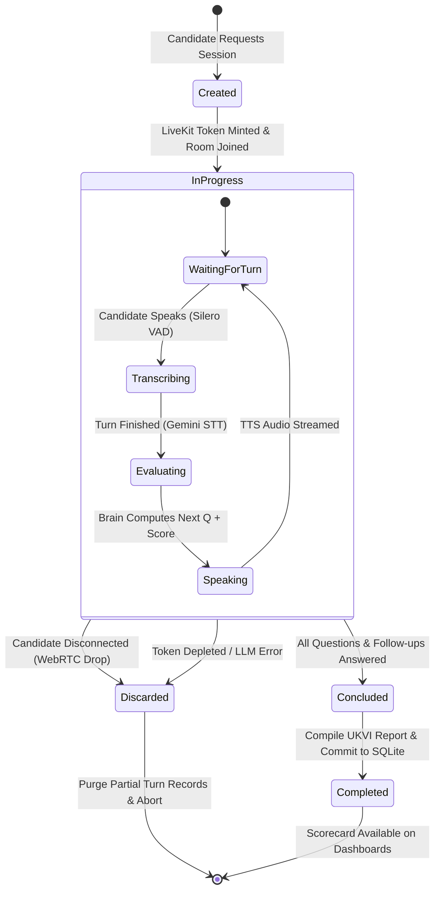

# SPEC-005: LiveKit Voice Lifecycle, Disconnect Discard Guard & Final Evaluation Persistence

| Metadata | Details |
|---|---|
| **Spec ID** | `SPEC-005` |
| **Title** | Direct LiveKit WebRTC Voice Session Lifecycle, Abort Discard Policy, and Evaluation Persistence |
| **Status** | `PROPOSED / IN-REVIEW` |
| **Version** | `1.0.0` |
| **Author** | Antigravity AI & Promit Bhattacharjee |
| **Created Date** | 2026-09-11 |
| **Governing Documents** | [constitution.md v2.1.0](file:///c:/Users/promi/OneDrive/Desktop/interviewv2/docs/constitution.md), [product_requirement.md](file:///c:/Users/promi/OneDrive/Desktop/interviewv2/product_requirement.md) |
| **Target Components** | `src/interview/live_kit/`, `src/interview/api/`, `src/interview/db/` |

---

## 1. Context & Motivation

Live voice interviews require sub-second conversational latency, resilient media streaming, and strict transactional data integrity. Custom WebSockets over TCP introduce head-of-line blocking, packet jitter, and heavy async processing loads on the FastAPI application server. 

To satisfy **Constitution Article I, Section 1 (Direct WebRTC Media)**, **Section 7 (Rubric-Driven Evaluation)**, and **Section 8 (Mid-Interview Disconnect & Token Runout Discard Policy)**:
1. **Direct WebRTC Stream:** Candidate audio streams directly between the browser client and the local LiveKit server (WebSocket signaling on port `7880`, WebRTC media on UDP `7882`).
2. **WebRTC Data Channels:** Real-time turn-by-turn evaluation scorecards, keyword hit badges, and final reports are broadcast directly over native WebRTC Data Channels (`publish_data`), bypassing custom API sockets.
3. **Mid-Interview Disconnect & Token Exhaustion Discard Policy:** If a candidate loses connection or if the LLM API token budget runs out mid-interview, the session is marked `discarded` and all partial turn evaluations are permanently purged from the database.
4. **Final Evaluation Persistence:** When all topics, questions, and follow-ups conclude normally, the LangGraph brain compiles the comprehensive UKVI Credibility Report and commits it permanently to SQLite.

---

## 2. Session Lifecycle & State Machine



### 2.1. Graph 2: The Decoupled `interview_execution_graph`
Unlike legacy architectures that merged question generation into the interview turn loop, `interview_execution_graph` is strictly an **execution-only state machine**:
1. **Zero On-The-Fly Generation:** The graph requires pre-approved questions. If `get_user_assigned_questions` returns empty, the interview cannot be instantiated.
2. **Turn Flow:**
   ```
   START ──► evaluate_answer ──► process_answer ──► ask_question ──► [generate_final_evaluation ──► END]
   ```
3. **Tool Ingestion:** Questions, topics, and follow-ups are hydrated into the turn sequence via `fetch_topics`, `fetch_questions`, and `fetch_followups`.

---

## 3. WebRTC Data Channel Protocol

The LiveKit Agent Worker broadcasts structured JSON messages to the browser client over the WebRTC Data Channel:

### 3.1. Turn Evaluation Packet (`type: "turn_evaluation"`)
Broadcast after every candidate response:

```json
{
  "type": "turn_evaluation",
  "data": {
    "topic_name": "Course & University Choice",
    "question_id": "q-1",
    "attempt_number": 1,
    "accuracy_score": 85.0,
    "is_passed": true,
    "is_reask": false,
    "matched_keywords": ["Artificial Intelligence", "Robotics Laboratory", "Specialized Curriculum"],
    "unmatched_keywords": [],
    "feedback": "Clear, direct justification of Hertfordshire course modules."
  }
}
```

### 3.2. Re-Ask Signal Packet (`is_reask: true`)
Emitted when score $< 70\%$ on Attempt 1:

```json
{
  "type": "turn_evaluation",
  "data": {
    "topic_name": "Financial Capability",
    "question_id": "q-2",
    "attempt_number": 1,
    "accuracy_score": 48.0,
    "is_passed": false,
    "is_reask": true,
    "matched_keywords": ["tuition fee"],
    "unmatched_keywords": ["living maintenance", "28-day holding rule", "sponsor bank statement"],
    "feedback": "Candidate must clarify 28-day maintenance funds compliance."
  }
}
```

### 3.3. Final UKVI Evaluation Report Packet (`type: "final_evaluation"`)
Broadcast upon session completion:

```json
{
  "type": "final_evaluation",
  "final_evaluation": {
    "overall_score": 88.5,
    "overall_status": "PASSED",
    "topic_breakdown": [
      {
        "topic_name": "Course & University Choice",
        "average_score": 90.0,
        "is_passed": true,
        "summary_feedback": "Demonstrated excellent knowledge of syllabus and campus facilities."
      },
      {
        "topic_name": "Financial Capability",
        "average_score": 87.0,
        "is_passed": true,
        "summary_feedback": "Verified £32,000 parental deposit exceeding tuition and UKVI 9-month maintenance."
      }
    ],
    "strengths": [
      "Explicit understanding of Level 7 AI curriculum",
      "Robust financial sponsorship with 28-day bank holding compliance"
    ],
    "areas_for_improvement": [
      "Could elaborate further on competing university comparisons"
    ],
    "recommendation": "The candidate has demonstrated genuine academic intent, verified financial credibility, and clear post-study career trajectory. Unconditional visa sponsorship recommended."
  }
}
```

---

## 4. Disconnect & Token Exhaustion Discard Guard

In accordance with user directives:

```python
# src/interview/live_kit/guard.py
from src.interview.db.models import InterviewSessionRecord, TurnEvaluationRecord

def handle_session_abortion(db: Session, session_id: str, reason: str) -> None:
    """
    Executes the strict discard policy:
    1. Updates session record status to 'discarded'.
    2. Deletes all partial TurnEvaluationRecord rows associated with this session.
    3. Prevents corrupted or half-baked scorecards from contaminating reporting.
    """
    session = db.query(InterviewSessionRecord).filter(InterviewSessionRecord.session_id == session_id).first()
    if session:
        session.status = "discarded"
        session.abort_reason = reason
        # Purge partial turn evaluation records
        db.query(TurnEvaluationRecord).filter(TurnEvaluationRecord.session_id == session_id).delete()
        db.commit()
```

---

## 5. Acceptance Criteria

- **AC-5.1 (Direct Media Streaming):** Audio flows directly between the browser and LiveKit server without passing through FastAPI async handlers.
- **AC-5.2 (Data Channel Synchronization):** Turn evaluation scorecards arrive in the candidate's browser within 150ms of brain evaluation completion.
- **AC-5.3 (Zero Partial State on Abort):** When an interview drops connection or encounters token exhaustion, no partial evaluation records remain in the database.
- **AC-5.4 (Complete Report Persistence):** Normal interview completions successfully commit the final UKVI evaluation report and status to SQLite.

---

## 6. Tasks & Phased Implementation

- [ ] **Task 5.1:** Update `src/interview/live_kit/agent.py` to support BYOK model credentials sourced dynamically from `CredentialVault`.
- [ ] **Task 5.2:** Implement LiveKit WebRTC Data Channel emitter for `turn_evaluation`, `reask`, and `final_evaluation` messages.
- [ ] **Task 5.3:** Implement disconnect and token runout discard handlers in `src/interview/live_kit/guard.py`.
- [ ] **Task 5.4:** Implement database persistence for completed sessions in `src/interview/db/session_repo.py`.
- [ ] **Task 5.5:** Write integration tests verifying the discard policy and final evaluation persistence in `tests/live_kit/test_lifecycle_and_discard.py`.
