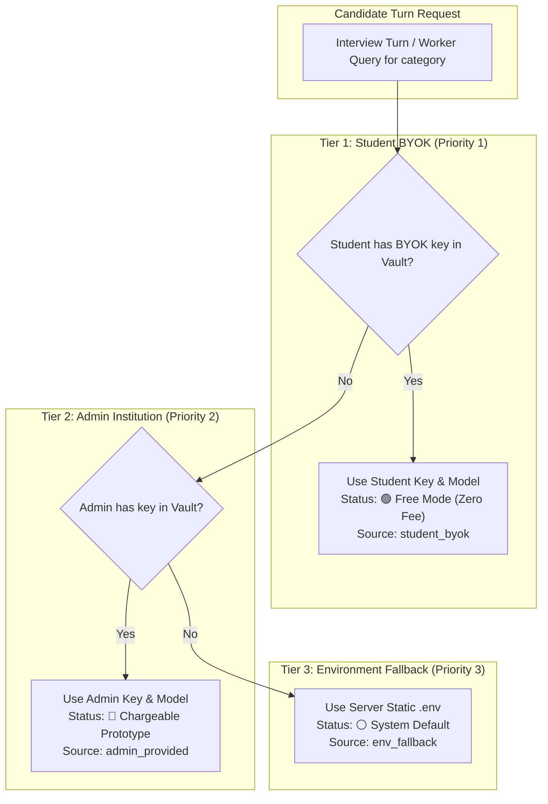

# SPEC-006: Dynamic 3-Model Credential Architecture & Open-Source BYOK

| Metadata | Details |
|---|---|
| **Spec ID** | `SPEC-006` |
| **Title** | Dynamic 3-Model Credential Architecture, Open-Source BYOK Pricing Model, and Hierarchical Resolution (Thinking, STT, TTS) |
| **Status** | `APPROVED / IMPLEMENTED` |
| **Version** | `1.0.0` |
| **Author** | Antigravity AI & Promit Bhattacharjee |
| **Created Date** | 2026-09-14 |
| **Governing Documents** | [constitution.md v2.1.0](file:///c:/Users/promi/OneDrive/Desktop/interviewv2/docs/constitution.md), [product_requirement.md](file:///c:/Users/promi/OneDrive/Desktop/interviewv2/product_requirement.md), [SPEC-002](file:///c:/Users/promi/OneDrive/Desktop/interviewv2/docs/specs/SPEC-002-relational-persistence-and-credential-vault.md), [SPEC-003](file:///c:/Users/promi/OneDrive/Desktop/interviewv2/docs/specs/SPEC-003-admin-portal-and-question-bank-lifecycle.md), [SPEC-004](file:///c:/Users/promi/OneDrive/Desktop/interviewv2/docs/specs/SPEC-004-student-portal-and-cas-workflow.md) |
| **Target Components** | `services/web_api/`, `services/langgraph_agent/`, `src/interview/` |

---

## 1. Context & Executive Motivation

Previous iterations of the UKVI Credibility Voice Interview system relied on static `.env` configuration files for model keys, with a monolithic BYOK field in the student profile that only accommodated a single generic API key. In real-world multi-tenant academic and open-source deployments, this created two major bottlenecks:
1. **Model Decoupling Requirement:** Voice interview agents rely on three fundamentally distinct AI engines:
   - **Thinking Model (LLM Brain):** Reasoner evaluating student responses against UKVI rubrics and planning question flow.
   - **Speech-to-Text (STT) Model:** Real-time microphone audio transcriber.
   - **Text-to-Speech (TTS) Model:** Real-time interviewer voice synthesizer.
   Users and administrators must be able to independently choose providers (e.g. OpenRouter DeepSeek for reasoning, Google Gemini for STT, and ElevenLabs or Cartesia for TTS) rather than being constrained to a single provider.
2. **Open-Source vs. Commercial Tier Dual Economics:**
   - **Student BYOK (Open Source Free Tier):** Candidates previously supplied keys individually.
   - **Admin / Institution Provisioning (Commercial Enterprise - SPEC-007 Standard):** Under SPEC-007, candidate API key capture has been completely eliminated in favor of 100% Institution-Admin custody in `CredentialVault`. Candidates advance directly to the voice interview using the institution's provisioned Thinking (DeepSeek Chat via OpenRouter), STT (Groq Whisper), and lowest-cost TTS (Deepgram Aura) engines.

---

## 2. Dynamic 3-Tier Resolution Hierarchy

Whenever an interview turn executes or a service requests model configuration for a candidate, the system evaluates the 3-tier resolution hierarchy independently for each category (`thinking`, `stt`, `tts`):



### Formal Resolution Function

$$\text{ResolveModelConfig}(c, u) = \begin{cases}
(K_{s}, M_{s}, \text{"student\_byok"}, \text{Free}) & \text{if } \exists V \in \text{Vault} : V.\text{user\_id} = u \land V.\text{category} = c \\
(K_{a}, M_{a}, \text{"admin\_provided"}, \text{Billed}) & \text{else if } \exists V \in \text{Vault} : V.\text{is\_admin} = \text{True} \land V.\text{category} = c \\
(K_{env}, M_{env}, \text{"env\_fallback"}, \text{Default}) & \text{otherwise}
\end{cases}$$

Where:
- $c \in \{\text{"thinking"}, \text{"stt"}, \text{"tts"}\}$
- $u$ is the candidate user identifier (UUID or username)
- $K$ is the decrypted API key
- $M$ is the resolved model identifier/voice

---

## 3. Database Schema: Extended Credential Vault

The `credential_vault` table (`services/web_api/src/api/db/models.py`) stores AES-256 encrypted credentials across the three functional categories:

```python
class ModelCategory(str, enum.Enum):
    THINKING = "thinking"
    STT = "stt"
    TTS = "tts"


class CredentialVault(Base):
    __tablename__ = "credential_vault"

    id = Column(String(36), primary_key=True, default=generate_uuid)
    user_id = Column(String(36), ForeignKey("users.id"), nullable=True, index=True)
    category = Column(String(50), default=ModelCategory.THINKING.value, nullable=False)
    provider = Column(String(50), nullable=False)
    model_name = Column(String(120), nullable=True)
    base_url = Column(String(255), nullable=True)
    voice = Column(String(50), nullable=True)
    encrypted_api_key = Column(Text, nullable=False)
    key_preview = Column(String(20), nullable=False)
    is_admin_key = Column(Boolean, default=False, nullable=False)
    created_at = Column(DateTime, default=lambda: datetime.now(timezone.utc))
    updated_at = Column(DateTime, default=lambda: datetime.now(timezone.utc), onupdate=lambda: datetime.now(timezone.utc))

    user = relationship("User", back_populates="credentials")
```

### Cryptographic Security Protocol
- **At Rest:** All API keys are encrypted using symmetric Fernet encryption (AES-128-CBC with PKCS7 padding and HMAC-SHA256 authentication).
- **In Transit:** Plaintext keys are never returned to client dashboards. Only safe masked previews (`mask_api_key(k) \to \text{"sk-...4a1b"}`) are visible in templates.
- **In Memory:** Keys are decrypted strictly in-memory within worker processes immediately before outbound API requests to AI providers.

---

## 4. Endpoints & User Experience Specifications

### 4.1. Admin Control Center (`/admin`)
- **Panel:** `⚙️ AI Engine & Model Configuration (Institution Defaults)`
- **Capabilities:**
  - Independent cards for Thinking, STT, and TTS.
  - Form parameters: `category`, `provider`, `api_key`, `model_name`, `base_url`, `voice`.
  - Save route: `POST /admin/credentials`
  - Revert route: `POST /admin/credentials/delete` (reverts to `.env` fallback)
  - Badge indicator: `Admin Chargeable (Prototype)` vs `Default (.env)`.

### 4.2. Student Portal (`/student`)
- **Panel:** `🔑 Bring Your Own Key (BYOK) — 3-Model Setup`
- **Capabilities:**
  - Explains the open-source zero-fee model.
  - Interactive cards displaying real-time resolution badges:
    - 🟢 `Your Key (Free)`: Student BYOK active.
    - 🔵 `Institution Key`: Using institution default.
    - ⚪ `System Default`: Using server `.env`.
  - Save route: `POST /student/credentials`
  - Remove route: `POST /student/credentials/delete` (reverts to Institution/Default key).

### 4.3. Relational API Route (`/api/students/{user_id}/model-config`)
- **Method:** `GET`
- **Response Schema:**
  ```json
  {
    "thinking": {
      "category": "thinking",
      "provider": "openrouter",
      "model_name": "deepseek/deepseek-v4-flash-0731",
      "base_url": "https://openrouter.ai/api/v1",
      "voice": null,
      "api_key": "sk-or-...",
      "key_preview": "sk-...xxxx",
      "source": "student_byok",
      "is_free": true,
      "label": "Your BYOK Key (Free)"
    },
    "stt": { ... },
    "tts": { ... }
  }
  ```

### 4.4. LiveKit Agent Worker & Dynamic Helper Engine
- **`src/interview/helper.py`:**
  - `get_thinking_llm(model_name, api_key, base_url, provider, temperature)`
  - `get_speech_llm(model_name, api_key, provider, temperature)`
  - `resolve_candidate_thinking_llm(user_id, temperature)`
- **`services/langgraph_agent/src/agent/worker.py`:**
  - Invocates `fetch_user_model_config` tool upon candidate connection.
  - Logs active 3-model resolution tiers.
  - Broadcasts `model_configuration` packet over WebRTC DataChannel in the `session_ready` event.

---

## 5. Acceptance Criteria

- **AC-6.1 (3-Model Independence):** Thinking, STT, and TTS must be configurable independently without requiring all three to be set simultaneously.
- **AC-6.2 (Student BYOK Precedence):** When a candidate configures a personal key for any category, that key must supersede any admin or environment configuration for that candidate.
- **AC-6.3 (Clean Fallback Chain):** Deleting a student key must seamlessly fall back to the admin institution key; deleting an admin key must fall back to `.env`.
- **AC-6.4 (Masked Security Guarantee):** No plaintext API keys may ever appear in HTML templates, console logs, or browser DOM.
- **AC-6.5 (WebRTC Live Broadcast):** The active model selection must be communicated over the LiveKit DataChannel to the candidate client interface.

---

## 6. Verification & Test Matrix

| Test Case | Description | Expected Outcome | Status |
|---|---|---|---|
| `test_encryption_and_masking` | AES-256 Fernet encrypt/decrypt and preview masking | Encrypted string $\neq$ raw; Decrypted == raw; Masked starts with prefix | ✅ Passed |
| `test_vault_service_save_and_delete` | Upsert and deletion of credentials in SQLite | Entry saved with category, deleted on command | ✅ Passed |
| `test_hierarchical_resolution_3_tiers` | Resolution order (Student BYOK > Admin > .env) | Correct `source` and `is_free` flag returned at each tier | ✅ Passed |
| `test_stt_and_tts_resolution` | Independent configuration for STT and TTS | Separate models, voices, and providers cleanly resolved | ✅ Passed |
| `test_student_and_admin_matrices` | Status dictionary generation for dashboards | Matrix contains status for all 3 categories | ✅ Passed |
| `test_helper_dynamic_llm_parameters` | Dynamic argument passing in `helper.py` | Chat models instantiate with dynamic credentials | ✅ Passed |
