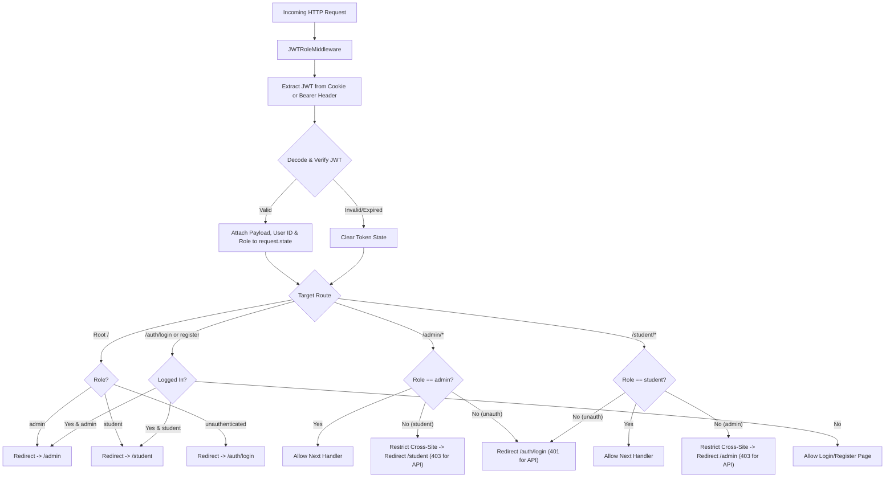

# SPEC-007: JWT Middleware Role Isolation, Dual Layouts, API Key Governance, and Mobile Bottom Navigation

| Metadata | Details |
|---|---|
| **Spec ID** | `SPEC-007` |
| **Title** | JWT Middleware Role Isolation, Dual Layout Architecture, API Key Governance & Revocation, and Mobile Bottom Navigation |
| **Status** | `APPROVED / IMPLEMENTED` |
| **Version** | `1.0.0` |
| **Author** | Antigravity AI & Promit Bhattacharjee |
| **Created Date** | 2026-09-14 |
| **Governing Documents** | [constitution.md v2.1.0](file:///c:/Users/promi/OneDrive/Desktop/interviewv2/docs/constitution.md), [product_requirement.md](file:///c:/Users/promi/OneDrive/Desktop/interviewv2/product_requirement.md), [SPEC-002](file:///c:/Users/promi/OneDrive/Desktop/interviewv2/docs/specs/SPEC-002-relational-persistence-and-credential-vault.md), [SPEC-003](file:///c:/Users/promi/OneDrive/Desktop/interviewv2/docs/specs/SPEC-003-admin-portal-and-question-bank-lifecycle.md), [SPEC-004](file:///c:/Users/promi/OneDrive/Desktop/interviewv2/docs/specs/SPEC-004-student-portal-and-cas-workflow.md), [SPEC-006](file:///c:/Users/promi/OneDrive/Desktop/interviewv2/docs/specs/SPEC-006-dynamic-3-model-credential-architecture.md) |
| **Target Components** | `services/web_api/`, `templates/`, `services/web_api/src/api/security/`, `services/web_api/src/api/routers/` |

---

## 1. Executive Summary & Problem Statement

In previous implementations, authentication and role authorization were enforced only at individual router endpoints via FastAPI dependencies (`require_admin`, `get_current_user`). This permitted cross-role navigation ambiguities, such as root `/` arbitrarily routing all users to the student dashboard, and lacked unified middleware interception. 

Furthermore, the portal used a single shared layout (`base.html`), mixing administrative navigation links with student links. Key management allowed students to enter BYOK keys even when the institution configured an administrative key, and admins lacked the ability to audit and clean/revoke candidate-provided API keys. Finally, mobile devices lacked an optimized bottom navigation bar tailored for an interactive voice interview platform.

This specification introduces:
1. **JWT Decode & Role Interception Middleware**: Automatic token decoding, session expiration handling, and strict bidirectional cross-site redirection (Admins cannot access Student pages; Students cannot access Admin pages).
2. **Dual-Website Layout Architecture**: Independent layouts for Admin (`admin/layout.html`) and Student (`student/layout.html`).
3. **Institutional API Key Governance & Student Lockout Rule**:
   - If an Admin key is configured for an AI engine category, candidates are strictly prohibited from submitting or modifying API keys for that engine.
   - If no Admin key is configured, candidates may provide and manage their own BYOK credentials.
   - Admin API keys are confidential: stored in the database vault and never exposed or rendered to candidates.
4. **Admin Key Revocation ("Clean Key") Control**: Admissions administrators can audit candidate BYOK status and revoke/clean candidate keys directly from the Admin control center.
5. **Mobile Bottom Navigation ("Interview")**: A touch-optimized, persistent mobile navigation bar for the interview platform providing immediate access to the live voice interview, dashboard, results, and CAS profile.
6. **Zero API Key Plaintext Storage**: `.env` is scrubbed of all actual API keys, moving credential custody exclusively into the encrypted relational database vault.

---

## 2. JWT Decode Middleware & Route Restriction Architecture



### 2.1. Route Invariants

| Route Pattern | Target Role | Unauthenticated Action | Cross-Role Action |
|---|---|---|---|
| `/` | Any | 303 Redirect to `/auth/login` | Redirects to dedicated dashboard (`/admin` or `/student`) |
| `/admin` & `/admin/*` | `admin` | 303 Redirect to `/auth/login` (401 for API) | If `student`: 303 Redirect to `/student?error=Access+denied` (403 for API) |
| `/student` & `/student/*` | `student` | 303 Redirect to `/auth/login` (401 for API) | If `admin`: 303 Redirect to `/admin?error=Access+denied` (403 for API) |
| `/auth/login`, `/auth/register` | Public | Render authentication views | If already logged in: Redirect to `/admin` or `/student` |
| `/auth/logout` | Any | Clear `access_token` cookie, Redirect to `/auth/login` | N/A |

---

## 3. Dual-Layout Portal Architecture

The platform provides two distinct, non-overlapping portal presentation layers:

```
templates/
├── admin/
│   ├── layout.html         <-- Dedicated Admin Portal Layout
│   ├── dashboard.html      <-- Extends admin/layout.html
│   ├── banks.html          <-- Extends admin/layout.html
│   ├── bank_detail.html    <-- Extends admin/layout.html
│   └── evaluations.html    <-- Extends admin/layout.html
├── student/
│   ├── layout.html         <-- Dedicated Candidate Portal Layout (with Mobile Bottom Nav)
│   ├── dashboard.html      <-- Extends student/layout.html
│   ├── interview.html      <-- Extends student/layout.html
│   └── results.html        <-- Extends student/layout.html
├── auth/
│   ├── login.html
│   └── register.html
└── base.html               <-- Minimal fallback layout for auth views
```

### 3.1. Admin Layout (`templates/admin/layout.html`)
- **Theme**: Deep Navy Slate with Indigo accents.
- **Header**: UKVI Admissions Command Center &bull; Institutional Compliance.
- **Navigation Bar**:
  - `Admin Dashboard` (`/admin`)
  - `Question Banks` (`/admin/banks`)
  - `Candidate Evaluations` (`/admin/evaluations`)
  - `Candidate Key Governance` (`/admin#key-governance`)
- **Strict Role Isolation**: Completely devoid of candidate action links or student routes.

### 3.2. Student Layout (`templates/student/layout.html`) & Mobile Bottom Nav
- **Theme**: Slate with UKVI Royal Blue & Emerald Accents.
- **Header**: UKVI Academic Credibility Voice Engine &bull; Candidate Portal.
- **Desktop Navigation Bar**:
  - `Candidate Dashboard` (`/student`)
  - `CAS Profile` (`/student#cas-profile`)
  - `Live Interview` (`/student/interview`)
  - `Results & Reports` (`/student/results`)
- **Mobile Bottom Navigation Bar**:
  - Attached to bottom viewport on small viewports (`d-md-none fixed-bottom`).
  - Glassmorphic backdrop with touch-friendly tap targets:
    1. 🏠 **Portal** (`/student`)
    2. 🎙️ **Interview** (`/student/interview`) - Elevated, high-contrast icon labeled "Interview".
    3. 📊 **Results** (`/student/results`)
    4. 👤 **CAS** (`/student#cas-profile`)
    5. 🚪 **Logout** (`/auth/logout`)
  - Safe-area bottom padding applied to the main content container to prevent occlusion.

---

## 4. Strict Admin-Only API Key Governance & Candidate Key Elimination

### 4.1. Complete Elimination of Candidate-Side Key Capture
Under the strict UKVI security and enterprise architecture policy, **candidates are entirely prohibited from providing, capturing, or modifying API credentials anywhere in the application**:

$$\text{CanStudentEditKey}(C) = \text{False} \quad \forall C \in \{\text{thinking}, \text{stt}, \text{tts}\}$$

1. **Student Dashboard (`templates/student/dashboard.html`)**:
   - Zero input forms, input elements, or submission buttons for API keys exist in the candidate UI.
   - Replaced with a read-only **Institutional AI Interview Engines** card detailing active models and verified readiness status.
   - Candidates simply verify their CAS profile, confirm their assigned question bank, and click **"Launch Voice Interview 🎙️"**.
2. **Backend Mutation Lockdown**:
   - `POST /student/credentials`, `POST /student/credentials/delete`, `POST /student/byok`, and `POST /student/api/credentials` unconditionally return `HTTP 403 Forbidden` (`"Candidate API key capture is disabled. Model engines are managed exclusively by institution administrators."`).
   - `vault_service.save_model_credential(..., is_admin=False)` and `vault_service.delete_model_credential(..., is_admin=False)` reject execution with `HTTP 403 Forbidden`.
3. **Institutional Model Provisioning**:
   - The platform is pre-configured and seeded with institution-managed engine keys in `CredentialVault` (`is_admin_key=True`):
     - **Thinking Engine**: DeepSeek Chat (`deepseek/deepseek-chat`) via OpenRouter (`https://openrouter.ai/api/v1`) using secure credential vault custody.
     - **Speech-to-Text (STT)**: Groq Whisper (`whisper-large-v3-turbo`) for high-throughput, ultra-low latency transcription.
     - **Text-to-Speech (TTS)**: Deepgram Aura (`aura-asteria-en`, voice: `Asteria`) at $0.015 / 1,000 characters (cheapest conversational TTS with sub-150ms TTFB).
4. **Credential Confidentiality**:
   - Institution API keys and secrets are never exposed in the candidate frontend or API responses (`active_preview` returns `"Institution Enforced (Protected)"`).

### 4.2. Admin Model Engine Configuration & Automated Provider Mapping
- Only authorized Admissions Officers (`UserRole.ADMIN`) configure or update model credentials via the Admin Command Center (`/admin#ai-engines`).
- **Automated Provider-to-Model Mapping**: Freeform "Model / Engine" manual text inputs have been removed from the STT interface to avoid user error and typos. Selecting an STT provider automatically maps to its recommended production model:
  - **Groq** $\implies$ `whisper-large-v3-turbo`
  - **OpenAI** $\implies$ `whisper-1`
  - **Deepgram** $\implies$ `nova-2`
  - **Google** $\implies$ `gemini-2.0-flash`
- **Elimination of Candidate Key Cleanup Section**: Because candidate-side key capture is completely disabled and zero candidate credentials exist in the database, the legacy candidate BYOK audit/clean-up table has been removed from the Admin dashboard.

---

## 5. Environment & Vault Security Sanitization

- Plaintext API keys (`GOOGLE_API_KEY`, `GEMINI_API_KEY`, `OPENROUTER_API_KEY`, etc.) are strictly forbidden in `.env` to prevent credential leakage.
- All real engine keys are securely encrypted using Fernet (AES-128-CBC + HMAC-SHA256) and held in the relational `CredentialVault` table via `seed_database()`.
- Dynamic credential resolution (`vault_service.resolve_model_config`) decrypts credentials on-demand in memory for worker and agent execution without writing secrets to disk.
