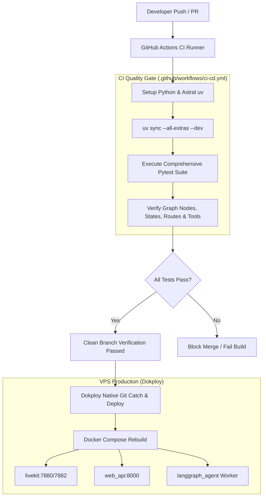

# SPEC-010: CI/CD Quality Gate, Comprehensive Test Matrix, and Native Git Dokploy VPS Deployment

| Metadata | Details |
|---|---|
| **Spec ID** | `SPEC-010` |
| **Title** | CI/CD Quality Gate, Comprehensive Test Matrix, and Native Git Dokploy VPS Deployment |
| **Status** | `APPROVED` |
| **Version** | `1.0.0` |
| **Author** | Antigravity AI & Promit Bhattacharjee |
| **Created Date** | 2026-09-17 |
| **Governing Documents** | [constitution.md v2.3.0](file:///c:/Users/promi/OneDrive/Desktop/interviewv2/docs/constitution.md), [product_requirement.md](file:///c:/Users/promi/OneDrive/Desktop/interviewv2/product_requirement.md), [dokploy_deployment_guide.md](file:///c:/Users/promi/OneDrive/Desktop/interviewv2/docs/deployment/dokploy_deployment_guide.md) |
| **Target Components** | `.github/workflows/ci-cd.yml`, `services/langgraph_agent/tests/`, `services/web_api/tests/`, `tests/` |

---

## 1. Context & Objectives

The autonomous interview platform operates in production on a host VPS managed through **Dokploy**. Dokploy tracks the GitHub repository directly via Git to automatically pull, build, and deploy the Docker Compose cluster (`web_api`, `langgraph_agent`, `livekit-server`).

To guarantee absolute system stability in production:
1. **Mandatory GitHub Actions Quality Gate:** Every push and pull request must execute an automated test matrix covering 100% of graph nodes, states, routers, and relational fetchers.
2. **Native Git Integration:** Dokploy catches updates directly from Git. The CI workflow ensures only green, verified code is integrated into deployment branches.
3. **Comprehensive Test Coverage:** Every functional unit—including question generation nodes, interview execution nodes, relational fetcher tools, TTS routing, database seeding, and JWT device lockdown—must be verified with deterministic pytest assertions.

---

## 2. CI/CD Architecture

---

## 3. Test Coverage Matrix

Every functional subsystem is mapped to dedicated test suites:

| Subsystem | Components Tested | Test Suite File |
|---|---|---|
| **Question Generation Graph** | `parse_curriculum_node`, `synthesize_topics_node`, `admin_review_checkpoint_node`, `commit_bank_node` | `services/langgraph_agent/tests/test_question_gen_nodes_and_tools.py` |
| **Relational Ingestion Tools** | `fetch_topics`, `fetch_questions`, `fetch_followups`, `get_user_assigned_questions`, `fetch_user_model_config` | `services/langgraph_agent/tests/test_question_gen_nodes_and_tools.py` |
| **Interview Execution Graph** | `evaluate_answer_node`, `process_answer_node`, `ask_question_node`, `generate_final_evaluation_node` | `services/langgraph_agent/tests/test_graphs.py` |
| **Keyword Ledger (SPEC-009)** | `RelationalKeywordLedger`, multi-turn accumulation, deduplication, scoring | `services/langgraph_agent/tests/test_spec009_cumulative_checklist.py` |
| **LiveKit Worker & Guard** | `process_candidate_turn`, `AbortDiscardGuard`, session lifecycle | `services/langgraph_agent/tests/test_livekit_worker_and_guard.py` |
| **Web API Routes & SSR** | Pre-assignment gate, student interview token minting, admin tree editor | `services/web_api/tests/test_routes_and_ssr.py` |
| **Turn-Gated Audio (SPEC-008)** | Instructions audio generation, gate evaluation | `services/web_api/tests/test_spec008_turn_gated_interview.py` |
| **Security & Middleware** | JWT authentication, 10-day cookie expiry, single device lockdown | `services/web_api/tests/test_tts_seed_and_middleware.py` |
| **TTS & Database Seeding** | `/api/tts/synthesize` fallback, `seed_default_data` | `services/web_api/tests/test_tts_seed_and_middleware.py` |
| **Relational Models & Vault** | Fernet AES-256 model encryption, credential resolution | `services/web_api/tests/test_models_vault_and_service.py`, `tests/test_dynamic_credentials.py` |

---

## 4. GitHub Actions Configuration (`.github/workflows/ci-cd.yml`)

- Runs on: `ubuntu-latest`
- Environment: Python 3.12 with `astral-sh/setup-uv`
- Execution: `uv sync` followed by `uv run pytest -v --tb=short`
- Fail-fast enforcement: Any test failure immediately marks the CI pipeline red and prevents deployment.
